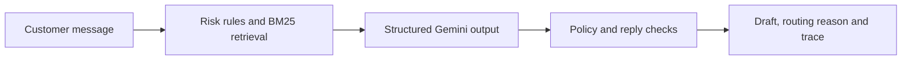

# Cadence

**An evaluated AI support agent for @SpotifyCares.**  
Hiver SDE Intern take-home · Arnav Bule

Cadence classifies customer messages into 12 intents, drafts replies grounded in historical support conversations, and decides whether to auto-handle or escalate—with a reason. The pipeline, baselines, data, receipts, and failures are available for inspection.

[**Open the demo**](https://www.arnavbule.in/hiver-assignment/) · [**Read the six-page report**](../output/pdf/Cadence-Arnav-Bule-Report.pdf) · [**Reproduce the results**](#reproduce-the-results) · [**View CI**](https://github.com/GODOSTROYER/cadence/actions/workflows/ci.yml)

> **Start here:** The review target is the reference `SupportAgent`, which remains the application default and the documented hosted-demo agent. The headline results below belong to its **frozen 200-message benchmark**, not to today's live requests. Quality, Balanced, and Verified are [separate experiments](#experimental-follow-ups); none replaces this benchmark or has been promoted to the default.

**Five-minute review:** Read the results below, check [label provenance](#data-and-human-review), then inspect [what failed](#five-failure-modes). For a code walkthrough, start at [`SupportAgent.handle()`](../src/cadence/agent/pipeline.py).

## Frozen benchmark: the result and its limit

All four systems below were evaluated on the same **200 messages**. The reference achieved **0.789 intent macro-F1**, **93.83% escalation recall**, and **35% automatic coverage**. It also missed **five required escalations among its 70 automatic decisions**. That is a measured prototype result—not a safety certification or a customer-resolution rate.

| System | Accuracy | Macro-F1 | Escalation recall | Auto / 200 | Missed / auto |
|---|---:|---:|---:|---:|---:|
| Trivial: majority intent + always escalate | 11.5% | 0.017 | 100.0% | 0/200 | N/A |
| Simple: keyword rules + nearest historical reply | 60.0% | 0.601 | 34.6% | 166/200 | 53/166 |
| Ablation: same-prompt agent without evidence (`k=0`) | 80.0% | 0.826 | 100.0% | 0/200 | N/A |
| **Reference: retrieval-grounded agent (`k=6`)** | **77.0%** | **0.789** | **93.8%** | **70/200** | **5/70** |

**Evidence:** [saved summary](../results/holdout_final/summary.json), [predictions](../results/holdout_final/predictions.jsonl), and [execution manifest](../results/holdout_final/manifest.json). The frozen execution is [`b8317d6`](https://github.com/GODOSTROYER/cadence/commit/b8317d6d91813d4d6d83336fb3eb05a1d032d52b). Labels originated with AI; author review was confirmed separately. [Review scope is documented below.](#data-and-human-review)

**Interpretation:** retrieval did **not** demonstrate a classification gain over `k=0`. Citation policy explains the no-evidence arm's zero automatic coverage; it does not establish a retrieval safety benefit. A two-order AI judge preferred reference replies by **1.42/5** over the simple baseline, but approved known bad replies. [Paired comparisons and judge failures](../REPORT.md).

## Reproduce the results

Use **Python 3.12**, the version exercised in CI. No LLM key, GPU, full Kaggle download, or frontend build is needed to replay the saved benchmark. Dependency installation requires internet access.

```bash
git clone --branch main --single-branch https://github.com/GODOSTROYER/cadence.git
cd cadence
python -m venv .venv
```

Activate the environment with `source .venv/bin/activate` on macOS/Linux, or `.venv\Scripts\Activate.ps1` in Windows PowerShell. Then run from the repository root:

```bash
python -m pip install -e ".[dev]"
python analysis_tools/reproduce_benchmark.py
```

**Expected:** `status: complete`, 200 predictions for each of four systems, `judge: complete`, and `model_calls: 0`. Detailed metrics are written to `results/reproduced/benchmark_summary.json`.

This validates artifact hashes, prediction coverage, and receipt keys, then recalculates metrics: **evidence replay, not fresh inference**. The [documented Linux/Windows CI run](https://github.com/GODOSTROYER/cadence/actions/runs/35033646086) completed installation, tests, and replays in 74/164 seconds. Those timings concern that revision; installation time varies. The headline replay is the intended under-15-minute review path.

### Check the implementation

```bash
python -m pytest -q
python -m ruff check src scripts tests api analysis_tools
```

[CI](workflows/ci.yml) also builds the UI and checks saved studies and publication consistency. Passing offline tests establishes those checks—not real-world reply quality.

<details>
<summary><strong>Other replay commands—and which evidence they describe</strong></summary>

Run these separately from the headline replay:

```bash
# Older, repeatedly inspected benchmark; not the 200-message table above.
python -m cadence.cli reproduce

# Later reference guards on already inspected receipts; retrospective regression.
python analysis_tools/post_audit_regression.py

# Separate Quality and Balanced experiments.
python analysis_tools/reproduce_quality.py
python analysis_tools/reproduce_balanced.py

# Common four-version development comparison; not final confirmation.
python analysis_tools/verify_portable_summaries.py development
```

The historical CLI replay checks 1,771 receipts and produces approximately 0.821 macro-F1—not the revised headline score. The [evaluator guide](../docs/EVALUATOR_GUIDE.md) and [Verified status](../docs/VERIFIED_STATUS.md) explain each replay and its provenance checks.

</details>

## How the reference agent works



The model proposes an intent, draft, citations, and routing decision. Policy and integrity checks can override it with escalation and a holding reply. Outputs retain evidence, guard decisions, latency, and token usage.

**A valid citation is not proof of a correct answer.** Historical replies are untrusted examples, not current Spotify policy. Guards block certain unsupported actions, links, and handoffs; they do not establish semantic correctness or eliminate prompt injection.

**Stack:** Python, FastAPI, Pydantic, Gemini, an in-repository BM25 retriever, and a React/TypeScript interface. [Python dependencies](../pyproject.toml), [model configuration](../config/models.yaml), and [API contracts](../CONTRACT.md) are committed. The [decision log](../DECISION_LOG.md) explains the scope and trade-offs.

## Data and human review

The [Twitter support dataset](https://www.kaggle.com/datasets/thoughtvector/customer-support-on-twitter) supplies **27,627 Spotify conversation openers**, predominantly from 2017, with procedural support and account-specific handoffs. Evaluation excludes held-out threads, overlapping components, and near duplicates. This is not a traffic-weighted estimate of today's support requests.

**The 200-message benchmark:** initial AI labels and individual rationales were locked before inference. Arnav Bule's review and approval of the examples and existing scores was confirmed on **16 September 2026**. This is **human-reviewed, AI-origin evidence**, not independently blind hand-labeling. The [label lock](../data/holdout/AI_REVIEW.lock.json), [review notes](../data/holdout/ai_review_notes.tsv), and [human-review record](../docs/HUMAN_REVIEW.md) preserve those distinctions.

**Judge–human agreement:** a separate study has **100 reply ratings over 50 matched messages**. AI-generated ratings were reviewed and accepted unchanged by Arnav on **17 September 2026**, with prior scores visible. Against both presentation orders of the original Gemini judge, agreement was **κ = 0.137**, **28% exact**, and **53% within one point**. This is verification, not an independent blind rating pass, and it does not human-validate the later four-version comparison. [Ratings and agreement](../results/review_study/arnav_verified_summary.json).

The later **200-case confirmation and 80-case challenge** packets still require completed human validation before candidate inference; existing AI proposals do not complete that work. [Annotation status](../output/validation/astra-ultra-flagged-v1/README.md) · [Evaluation workflow](../docs/VERIFIED_EVALUATION.md).

## Five failure modes

These are failures in the frozen reference run, not invented demonstration cases. Exact messages, replies, and repair boundaries are in the [failure analysis](../docs/FAILURE_ANALYSIS_FRESH.md).

| Failure | Recorded example | Engineering lesson |
|---|---|---|
| Missing context becomes obsolete advice | `h_003`: an unspecified “maximum” becomes a download answer with an old numeric limit. | Historical evidence must not fill in a missing problem or become current policy. |
| The draft claims an action the agent cannot perform | `h_168`: a request about a DM becomes a claim that a DM was sent. | Support-agent language is not evidence of tool execution. |
| Frustration is answered instead of escalated | `h_079`, `h_105`: churn/frustration cases miss required handling. | A polite reply can still violate routing policy. |
| Conservative guards suppress useful answers | `h_126`: a feature-suggestion request receives a holding reply. | Intent confidence and release safety are different signals. |
| Tone or keywords obscure the main intent | Seven playback→feedback and five billing→subscription errors. | Measure class boundaries, not only aggregate accuracy. |

Later reference guards changed three archived replies to holding replies. Those fixes have [separate regression evidence](../results/post_audit_regression/summary.json); they do not rewrite the frozen results or inherit the original reply-quality scores.

### What is misleading about the headline number?

**Auto-handled is not resolved.** Coverage counts routing decisions, not successful customer outcomes. **High recall can come from escalating everything.** It must be read alongside coverage and missed escalations. **Macro-F1 is uncertain on rare intents.** Some classes contain only 1–5 examples. **A high judge score can approve the wrong answer.** Review provenance and case-level failures matter more than a flattering average. **Current code cannot inherit a frozen score.** Replays, later fixes, and live requests are different evidence.

## Run the demo locally

After the Python setup above, use **Node.js 22** and npm for the UI:

```bash
cd ui
npm ci
npm run build
cd ..
python -m cadence.cli build-index
python -m cadence.cli serve
```

Open `http://127.0.0.1:8000`; API documentation is at `http://127.0.0.1:8000/api/docs`. Run the local service on a trusted workstation, not as an unauthenticated public service.

For fresh replies, copy [`.env.example`](../.env.example) to `.env`, set `GEMINI_API_KEY`, and restart. Defaults are in [model configuration](../config/models.yaml), not the example overrides. Without a key, or with `CADENCE_CACHE_ONLY=1`, uncached requests return **503**. `CADENCE_LLM=mock` provides offline smoke output, not benchmark evidence.

**Privacy:** live inference sends text and context to the provider. Use public or fictional messages; never commit keys. Check project [quotas](https://ai.google.dev/gemini-api/docs/rate-limits) and [data-use terms](https://ai.google.dev/gemini-api/terms). The scripts' `--live-free-tier` flag records intent, not verified billing status.

The [deployment record](../docs/DEPLOYMENT.md) identifies the reference selection and runtime health endpoint. Dashboard metrics describe saved evaluations, not live accuracy.

## Experimental follow-ups

These studies are preserved to explain what was tried after the reference evaluation. **They are not replacement headline results.**

| Candidate | Question investigated | Status |
|---|---|---|
| [Quality](../docs/QUALITY_ACCEPTANCE.md) | Can approved actions and server-owned wording prevent unsupported replies? | Conservative routing, sharply reduced coverage; not promoted. |
| [Balanced](../docs/BALANCED_ACCEPTANCE.md) | Can broader supported answers recover useful automation? | Recovered coverage but failed its fixed safety gate; not promoted. |
| [Verified](../docs/VERIFIED_STATUS.md) | Can request-first risk assessment, prerequisites, and scoped knowledge improve the trade-off? | Development/calibration failures remain; the later targeted patch lacks broad confirmation; not promoted. |

<details>
<summary><strong>Read the four-version development comparison</strong></summary>

Under the common policy-v2 review of the same 80 development messages, useful automatic replies were **8 Reference / 7 Quality / 20 Balanced / 22 Initial Verified**. Initial Verified missed three required escalations versus Balanced's two. Its **+2.50-point** useful-coverage difference had a paired 95% interval of **−6.28 to +12.50 points**. It also produced fewer useful resolution-style replies and more clarifications.

The older outputs were re-reviewed without regeneration, all new labels and ratings were AI-authored, and reviewer variation is a documented limitation. The later 18-case patch test is a different selected regression—not this comparison and not confirmation. [Common-study evidence](../docs/VERIFIED_DEVELOPMENT_COMPARISON.md) · [Latest status](../docs/VERIFIED_STATUS.md).

</details>

**With one more week:** finish the reserved human labels, freeze the systems and acceptance criteria, run the matched 200-message confirmation with a separately reported 80-case challenge, and obtain prespecified exact-reply human review. Prefer demonstrated useful automation under the safety requirements—not the newest architecture or the largest isolated score.

## Deliverables and code map

| Start here | What to inspect |
|---|---|
| [Six-page report](../output/pdf/Cadence-Arnav-Bule-Report.pdf) · [report source](../REPORT.md) | Framing, baselines, failures, misleading metrics, and next steps. |
| [200-example evaluation data](../data/holdout/) | Labels, rationales, sampling locks, and human-review scope. |
| [Evaluation implementation](../src/cadence/eval/) · [frozen run](../results/holdout_final/) | Metrics, two-order judging, predictions, and receipts. |
| [Decision log](../DECISION_LOG.md) · [engineering audit](../docs/IMPLEMENTATION_AUDIT.md) | Non-obvious choices, alternatives, and known limits. |
| [Agent](../src/cadence/agent/) · [retrieval](../src/cadence/retrieval/) · [data preparation](../src/cadence/data/) | The core request path and evidence preparation. |
| [API](../api/) · [UI](../ui/) · [tests](../tests/) | Application entrypoint, interface, and automated checks. |

## Scope and attribution

Cadence drafts and routes; it does **not** issue refunds, change accounts, send DMs, or post tweets. Full conversation state, image interpretation, fine-tuning, and autonomous account actions are outside this take-home's scope.

AI assistance was used for implementation, auditing, and identified annotations. Dependencies are declared in [Python](../pyproject.toml) and [UI](../ui/package-lock.json) manifests; borrowed methods and sources are in the [audit](../docs/IMPLEMENTATION_AUDIT.md).

**Arnav Bule** · [Portfolio](https://www.arnavbule.in) · [GitHub](https://github.com/GODOSTROYER)

<sub>This is the repository-home README. The original root README and all checksum-sealed submission artifacts are retained unchanged; see the <a href="../results/acceptance/release.json">publication record</a>.</sub>
