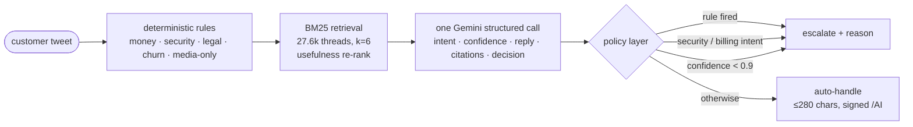

<div align="center">

# Cadence

**An AI support agent that knows when to stay quiet.**

Classifies a customer tweet, drafts a reply grounded in 27,627 real @SpotifyCares conversations, decides whether a human must step in, and then proves how well it does all three.

[](https://www.arnavbule.in/hiver-assignment/)
[](REPORT.md)
[](docs/EVALUATOR_GUIDE.md)


*Hiver SDE Intern take-home · Arnav Bule*

</div>

<a href="https://www.arnavbule.in/hiver-assignment/"></a>

## Start here

| | |
|---|---|
| **Try it** | [arnavbule.in/hiver-assignment](https://www.arnavbule.in/hiver-assignment/) — paste a tweet, watch the intent, the decision, the evidence and the drafted reply. The playground runs the real model; five free-tier Gemini keys are pooled behind it, and you can paste your own if they run dry. |
| **Score it** | [docs/EVALUATOR_GUIDE.md](docs/EVALUATOR_GUIDE.md) — every rubric item mapped to a number and the file that proves it, in fifteen minutes. |
| **Read it** | [REPORT.md](REPORT.md) (framing, method, results vs. seven baselines, failure analysis, what is misleading, next week) · [DECISION_LOG.md](DECISION_LOG.md) (18 decisions with the why) · [docs/FAILURE_ANALYSIS.md](docs/FAILURE_ANALYSIS.md) (five modes, verbatim). |
| **Reproduce it** | `python -m cadence.cli reproduce` replays every Gemini call from the committed cache. No key, about three minutes. |

## Headline numbers

200 held-out, hand-labelled test tweets. 95% bootstrap confidence intervals. Third and final run.

| Task | Agent | Best simple baseline | Trivial baseline |
|---|---|---|---|
| Intent (12 classes), macro-F1 | **0.82** [0.76–0.87] | 0.61 keyword rules | 0.02 majority class |
| Escalation recall / auto-handle rate | **0.94** [0.88–0.99] / **43%** | 0.41 / 82% rules only | 1.00 / 0% always escalate |
| Reply quality, blind LLM judge (1–5) | **4.58** [4.46–4.69] · 90% ship-as-is | 3.32 nearest historical reply | 2.56 brand template |

**Read this before quoting any of them.** The recall figure is a policy setting: without the confidence guard the same model scores 0.76 at 65% auto-handle. Retrieval does nothing for classification (the no-retrieval ablation ties at 0.82); what it buys is the reply. The golden set was labelled by two AI passes from one guide, so its κ of 0.96 is an upper bound on human agreement. No human judge-agreement ratings exist yet. All eight caveats: [REPORT.md §5](REPORT.md#5-what-is-misleading-about-my-headline-number), also printed on the site under the numbers.

## What it does



- **Intents** — 12, defined from the data by clustering and reading, frozen before labelling: [`config/intents.yaml`](config/intents.yaml), method in [`docs/TAXONOMY.md`](docs/TAXONOMY.md).
- **Escalation policy** — 8 reason codes; rules can only *add* escalations, never remove them: [`config/escalation.yaml`](config/escalation.yaml).
- **Brand voice** — measured from 43k replies (greetings, sign-offs, emoji rate, per-intent resolution patterns): [`docs/BRAND_VOICE.md`](docs/BRAND_VOICE.md).
- **Golden set** — 250 tweets, stratified sampling, two independent passes + adjudication, 50 dev / 200 test: [`data/golden/`](data/golden/), [`docs/SAMPLING_NOTE.md`](docs/SAMPLING_NOTE.md).
- **Evaluation** — bootstrap CIs, threshold sweep, comparative blind LLM judge on a *different* model, judge-vs-human agreement (κ, ρ), automatic failure-mode mining read by hand after every run: [`src/cadence/eval/`](src/cadence/eval/).
- **Baselines** — majority class, keyword rules, TF-IDF + logistic regression (out-of-fold), zero-shot LLM without retrieval, always/never escalate, brand template, nearest historical reply.

## The live deployment

The public site at **[arnavbule.in/hiver-assignment](https://www.arnavbule.in/hiver-assignment/)** is the pitch plus the working agent:

- **Public** — the landing page (results, caveats, how it works), the live playground and the method page. The agent runs in a slim serverless function ([`api/index.py`](api/index.py)) with the same model and keys used for the evaluation; the retriever is built at cold start from the committed corpus.
- **Bring your own key** — the playground accepts a Gemini key from [AI Studio](https://aistudio.google.com/apikey); it stays in the browser tab and is sent only with that visitor's requests. (Five free-tier keys are pooled behind the demo. Yes, five. The free tier allows roughly twenty thinking-model calls a day per key, which is also why the evaluation runs on Flash-Lite.)
- **Admin** — the evaluation dashboards, golden explorer, failure modes, blind rating flow and decision log sit behind a sign-in. The function issues a signed HttpOnly session cookie and serves the internal JSON only to that session; nothing internal is downloadable from the public site. Ask me for access, or run it locally where everything is open.

<p align="center"> </p>

## Reproduce the numbers (no API key, under 15 minutes)

```bash
git clone https://github.com/GODOSTROYER/cadence.git && cd cadence
python -m pip install -e ".[dev]"          # Python 3.11+
python -m cadence.cli reproduce            # index (~2 s) → agent + baselines → judge → metrics → export  (~3 min)
```

Every Gemini call behind the reported numbers is in `cache/llm_cache.sqlite` (1,771 entries) and replays byte-for-byte. Outputs land in `results/`: `eval_summary.json`, `failure_modes.json`, `predictions.jsonl`, `judge_scores.jsonl`, `figures/`.

Then look at it locally with everything unlocked:

```bash
cd ui && npm install && npm run build && cd ..
python -m cadence.cli serve                # http://127.0.0.1:8000
```

<details>
<summary><b>Run it live with your own key</b></summary>

```bash
cp .env.example .env                       # GEMINI_API_KEY=... or GEMINI_API_KEYS=k1,k2,... (free at aistudio.google.com)
python -m cadence.cli run -- --fresh       # re-run the agent live; rate-limited, cached, resumable
python -m cadence.cli judge -- --fresh
python -m cadence.cli evaluate
```

Several keys are pooled automatically: a 429 puts one key on cooldown and the next is tried at once.
</details>

<details>
<summary><b>Rebuild from the raw Kaggle data</b></summary>

Download `twcs.csv` from [thoughtvector/customer-support-on-twitter](https://www.kaggle.com/datasets/thoughtvector/customer-support-on-twitter) into `data/raw/twcs/twcs.csv`, then:

```bash
python -m cadence.cli prepare-data         # 2.8M rows → 27,627 SpotifyCares threads (~30 s)
python -m cadence.cli sample               # stratified golden-set candidates
```

The processed brand subset is committed, so this is optional.
</details>

## How the proof was built

1. **Contract first.** [`CONTRACT.md`](CONTRACT.md) pinned every schema, path and module seam before any code, so the data pipeline, retrieval, LLM layer, agent, baselines, evaluation, API and UI could be built independently and still fit.
2. **Taxonomy from the data, then frozen.** TF-IDF + k-means over the openers, hundreds read by hand, boundary rules written down, no changes once labelling started.
3. **Labels with a paper trail.** Two independent passes from the same guide, 14 disagreements adjudicated with written rationales, agreement reported next to model accuracy.
4. **Three evaluation runs.** Reading the first run's errors found three defects (placeholder links in replies, a judge that penalised the mandated signature, a churn rule that missed "switching to @user"); reading the second found two more caused by the fixes. Each fix is a named defect, each earlier run is kept (`results/v1`, `results/v2`), and the intent numbers never moved, which is the evidence that nothing was tuned to the labels.
5. **Honesty as a feature.** The caveats live in the results file and render under the headline tiles.

## Repository map

```
config/            intents.yaml · escalation.yaml · models.yaml
src/cadence/       data · retrieval · llm · agent · baselines · eval · api · cli
api/index.py       serverless live agent + admin session (Vercel)
scripts/           01_prepare_data … 07_export_ui_data, resolve_links, make_label_chunks, build_golden
data/processed/    spotify_threads.jsonl.gz · openers.parquet · link_map.json · reply_templates.json · stats.json
data/golden/       golden_set.jsonl · annotations_{a,b}.jsonl · adjudication.jsonl · LABELLING_GUIDE.md
results/           predictions · judge_scores · eval_summary · failure_modes · figures/ · v1/ · v2/ · ui/
cache/             llm_cache.sqlite (committed replay cache) · bm25_index.pkl (rebuilt in ~1 s)
ui/                Vite + React + Tailwind: landing, playground, evaluation, golden explorer, failures, rating, decisions, method
docs/              EVALUATOR_GUIDE · TAXONOMY · BRAND_VOICE · SAMPLING_NOTE · FAILURE_ANALYSIS (+ v1, v2)
```

## Tests

```bash
python -m pytest                           # 250+ tests, no network, < 20 s
python -m ruff check src scripts tests
cd ui && npm run typecheck && npm run build
```

## What I borrowed

- **Dataset:** Customer Support on Twitter (Kaggle, thoughtvector), used under its Kaggle terms; the SpotifyCares subset is redistributed here in processed form for reproducibility.
- **Libraries:** pandas, scikit-learn, scipy, pydantic, FastAPI, google-genai, rich, typer, matplotlib, rapidfuzz; React, Vite, Tailwind, framer-motion, recharts, lucide. BM25 is implemented in [`src/cadence/retrieval/bm25.py`](src/cadence/retrieval/bm25.py) (Okapi BM25, k1=1.5, b=0.75) rather than imported.
- **Fonts:** Instrument Serif, Geist, Geist Mono via Google Fonts.
- **Methods:** Cohen's weighted κ via scikit-learn; percentile bootstrap CIs; the comparative blind-judge setup follows common LLM-as-judge practice (shuffled anonymised candidates against position bias).
- **AI coding assistants** were used freely, as the brief allows, for code, the two annotation passes and the adjudication. The taxonomy, policy, labelling guide, rubric and every decision are written down so anyone can re-label a sample and compare.

## License

MIT. Built by [Arnav Bule](https://www.arnavbule.in) · [GitHub](https://github.com/GODOSTROYER) · arnav.bule05@gmail.com
