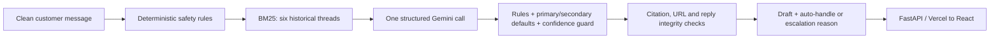

# Cadence

An evaluated support-agent prototype for **@SpotifyCares**, built for the Hiver SDE Intern take-home. It classifies an incoming tweet, drafts a reply using historical support conversations, and decides whether to escalate, with a reason.

**Read the evidence before the demo:** [Report](REPORT.md) · [Engineering audit](docs/IMPLEMENTATION_AUDIT.md) · [Decision log](DECISION_LOG.md) · [Evaluator guide](docs/EVALUATOR_GUIDE.md).

## What the evidence actually establishes

- The original, repeatedly inspected 200-example test set gives **0.821 intent macro-F1, 0.940 escalation recall and 43% auto-handling**. These are archived results from the older agent, not performance claims for this branch.
- A new **200-example AI-reviewed benchmark** was sampled, labelled with individual rationales, and locked before predictions. See [label provenance](data/holdout/AI_REVIEW.lock.json), [all review notes](data/holdout/ai_review_notes.tsv) and [run manifest](results/holdout/manifest.json).
- On the 50-example development set, a controlled retrieval ablation finds **no measured classification improvement**. A two-order AI judge prefers retrieved *pre-guard drafts* by **1.15 points on a 1–5 scale**, paired 95% bootstrap CI **[0.70, 1.625]**, on 20 messages. Preference agrees across candidate order on only **70%** of these messages.
- **There are no human labels or human judge-agreement measurements.** At the author's request, Codex reviewed all new examples. This is an AI benchmark, not a substitute for the assignment's hand-labeling and human-agreement requirements. The reviewer also worked on the implementation.

## Reproduce without a key (under 15 minutes)

Python 3.12 is the tested version. From this branch:

```bash
python -m pip install -e ".[dev]"
python -m cadence.cli reproduce
python -m pytest -q
```

`reproduce` verifies hashes of archived inputs and 1,771 cached-call receipts, then recomputes historical metrics into `results/reproduced/`. It makes **zero model calls**. It is **artifact replay**, not execution of the changed agent and not a live latency benchmark. Recalculation took approximately 1.4 seconds after imports on the audit machine; installation depends on your connection.

For the revised benchmark, follow [the evaluator guide](docs/EVALUATOR_GUIDE.md). The initial fresh run is incomplete (31/200 messages per system) after a provider timeout error; `results/holdout/run_status.json` records it. Final code has fixed the defect, but has not completed a new benchmark. Raw predictions, receipts and fingerprints remain separate from archived results. Do not overwrite or retune against either benchmark.

## Architecture



The corpus contains 27,627 conversation openers derived from the Kaggle Twitter support dataset. Twelve intents, the preparation contract, and the labeling guide are committed. Retrieval excludes held-out threads and near duplicates during evaluation. Retrieved conversations are untrusted historical examples, not current policy or service status.

Release checks block missing/invalid citations, unsupported links, dangling resource references, sensitive-data requests, and certain unsupported commitments. A block produces a holding reply and escalation. These checks **do not establish semantic entailment or eliminate prompt injection**. Intent confidence is an ordinal model output, not calibrated escalation risk.

## Run the application

```bash
cd ui
npm ci
npm run build
cd ..
python -m cadence.cli serve
```

Open `http://127.0.0.1:8000`. This local service is for a trusted workstation. The deployable entrypoint is `api/index.py`, with admin authentication, input validation, sanitized errors and bounded per-process concurrency.

The [existing public demo](https://www.arnavbule.in/hiver-assignment/) was inspected read-only. **It has not been redeployed from this branch; its running commit is unavailable.** Its dashboard metrics and screenshots describe the historical build. Do not use that endpoint to validate these changes.

## Optional live experiments

Copy `.env.example` to `.env` and configure `GEMINI_API_KEY` or comma-separated `GEMINI_API_KEYS`. Keys stay out of source control. Google enforces quotas **per project**, so multiple keys do not necessarily add capacity; actual quotas appear in AI Studio. [Quota documentation](https://ai.google.dev/gemini-api/docs/rate-limits).

Live scripts require `--live-free-tier`; without it they permit cached responses only. This flag records the operator's intention, **not verification of project billing**. Use a confirmed free-tier project. Unpaid Gemini services may use prompts and outputs to improve Google's products; use only public or fictional messages. [Terms](https://ai.google.dev/gemini-api/terms).

```bash
python scripts/10_experiment.py --help
python scripts/12_run_holdout.py --help
```

The locked runner refuses silently mixing code/label revisions. Re-running after seeing errors does not create a fresh holdout. Another benchmark requires new unseen data and a new lock.

## Repository map

| Path | Purpose |
|---|---|
| `CONTRACT.md`, `config/` | Schemas, intent/policy definitions, model settings |
| `src/cadence/data/`, `retrieval/`, `agent/` | Preparation, BM25, structured generation and release policy |
| `src/cadence/eval/`, `scripts/08_*`–`13_*` | Locked sampling, paired comparisons, two-order judging |
| `data/golden/` | Historical AI annotations: 50 dev / 200 reused test |
| `data/holdout/` | Fresh locked sample, 200 AI labels and individual rationales |
| `results/dev_experiment/`, `results/holdout/` | Revised experiments, separate from archived evidence |
| `api/`, `ui/` | Serverless API and React interface |
| `tests/`, `.github/workflows/` | Offline contract tests and Windows/Linux/UI CI |

## Borrowed work and scope

Data: [thoughtvector / Customer Support on Twitter](https://www.kaggle.com/datasets/thoughtvector/customer-support-on-twitter). Dependencies are declared in `pyproject.toml` and `ui/package-lock.json`. External methods and provider documentation are cited in the [audit](docs/IMPLEMENTATION_AUDIT.md). AI assistance was used for implementation, auditing and explicitly identified annotations. Historical reports are retained under `docs/*_historical.md`; their claims are superseded by this report.

No account actions, tweet posting, fine-tuning, multimodal interpretation or production deployment are included. The objective is a reproducible, inspectable take-home with limitations visible beside results.
