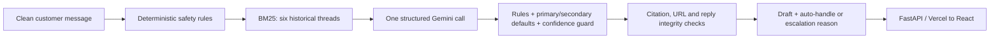
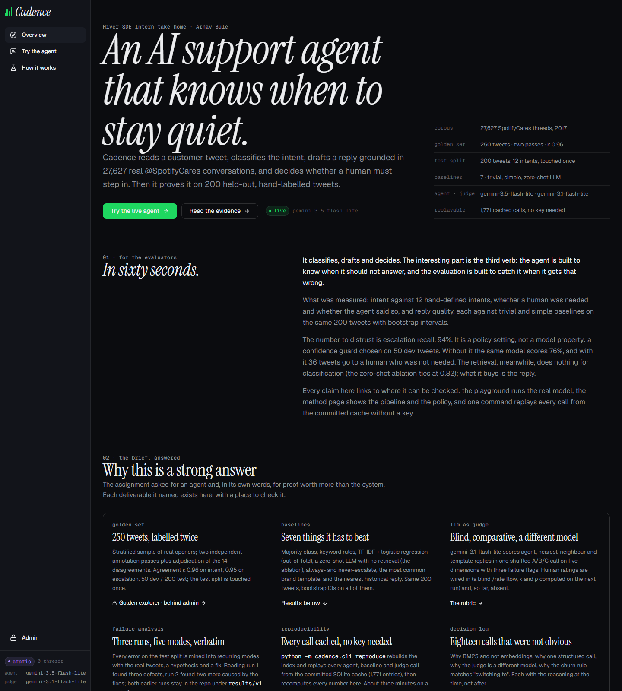
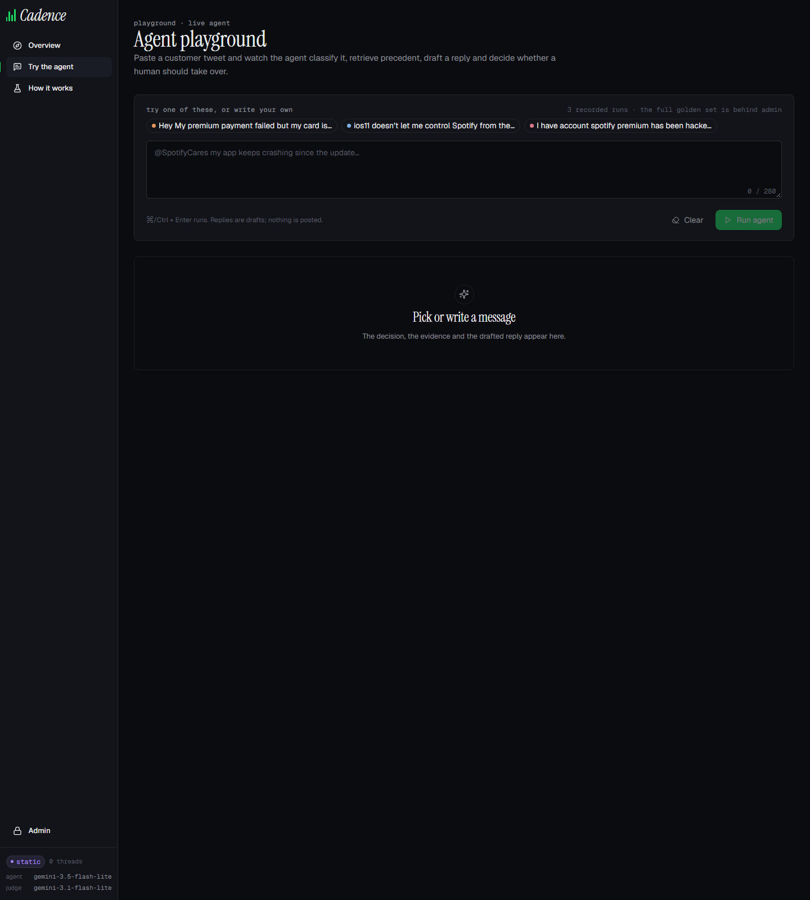
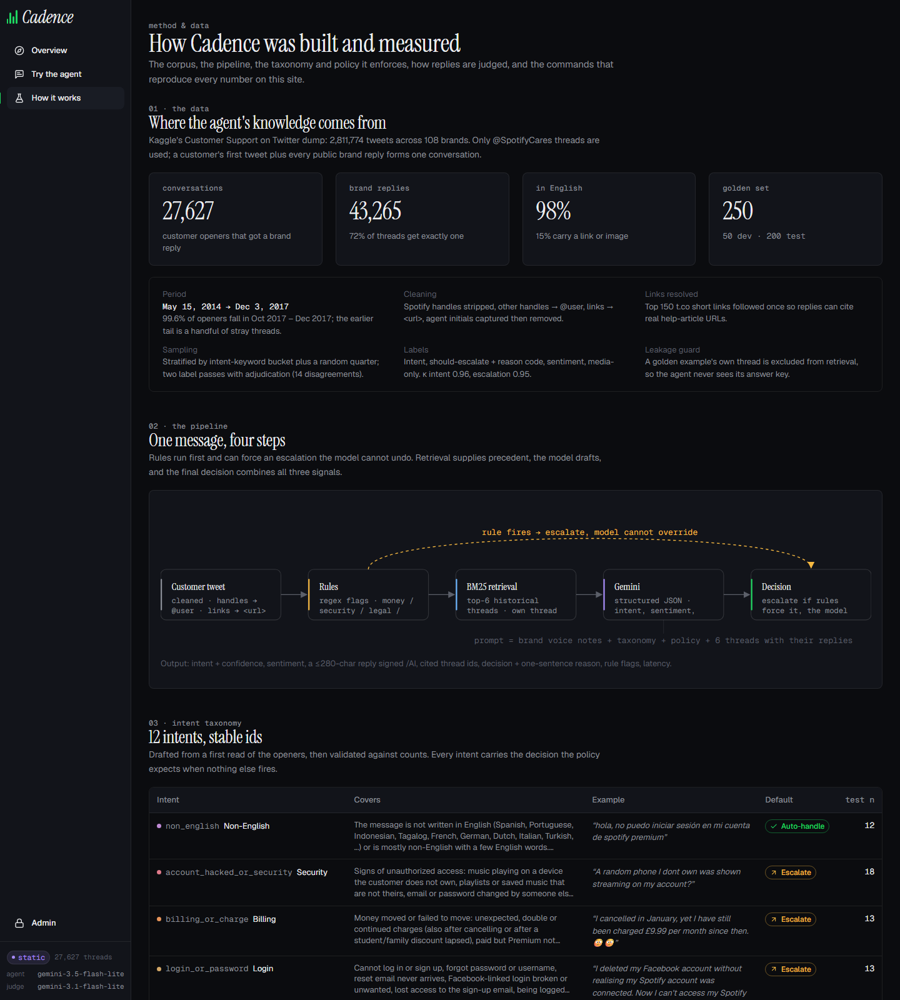

# Cadence

An evaluated support-agent prototype for **@SpotifyCares**, built for the Hiver SDE Intern take-home. It classifies an incoming tweet, drafts a reply using historical support conversations, and decides whether to escalate, with a reason.

**Read the evidence before the demo:** [Report](REPORT.md) · [Engineering audit](docs/IMPLEMENTATION_AUDIT.md) · [Decision log](DECISION_LOG.md) · [Evaluator guide](docs/EVALUATOR_GUIDE.md).

**Live demo:** [www.arnavbule.in/hiver-assignment](https://www.arnavbule.in/hiver-assignment)

## What the evidence actually establishes

- The frozen revised agent achieves **0.789 intent macro-F1, 0.938 escalation recall and 35% auto-handling** on 200 messages reviewed by Arnav Bule. It misses five required escalations among 70 automatic decisions. This is a measured prototype result, not a production safety certification.
- The **200-example benchmark, human-reviewed by Arnav Bule** was sampled, labelled with individual rationales, and locked before predictions. See [completed review](docs/HUMAN_REVIEW.md), [all review notes](data/holdout/ai_review_notes.tsv) and [frozen run manifest](results/holdout_final/manifest.json).
- The full controlled k6/k0 comparison finds **no demonstrated classification gain**. A two-order AI judge prefers released agent replies to nearest-baseline replies by **1.42/5**, paired 95% CI **[1.145, 1.668]**, across all 200 messages. Order consistency is **73.5%**, and it approves known unsafe replies: the report explains why that positive score is insufficient.
- **Human review and approval completed by Arnav Bule for all 200 examples and their existing scores**, confirmed on 16 September 2026. See the [human review record](docs/HUMAN_REVIEW.md).

## Reproduce without a key (under 15 minutes)

Python 3.12 is the tested version. [Clean Linux and Windows CI](https://github.com/GODOSTROYER/cadence/actions/runs/35033646086) completed installation, tests and both evidence replays in 74 and 164 seconds respectively; UI build also passed. From a fresh directory:

```bash
git clone --branch main --single-branch https://github.com/GODOSTROYER/cadence.git
cd cadence
python -m pip install -e ".[dev]"
python analysis_tools/reproduce_benchmark.py
python -m cadence.cli reproduce
python -m pytest -q
```

`reproduce` verifies hashes of archived inputs and 1,771 cached-call receipts, then recomputes historical metrics into `results/reproduced/`. It makes **zero model calls**. It is **artifact replay**, not execution of the changed agent and not a live latency benchmark. Recalculation took approximately 1.4 seconds after imports on the audit machine; installation depends on your connection.

`reproduce_benchmark.py` recomputes the revised benchmark from saved predictions and validates receipt keys without model calls. The frozen execution is `b8317d6`; the earlier timeout-aborted run remains under `results/holdout/`. General release-guard fixes made after failure inspection have a separate [cache-only regression](results/post_audit_regression/summary.json), not fresh accuracy evidence. Follow [the evaluator guide](docs/EVALUATOR_GUIDE.md) to inspect all three evidence layers.

## Architecture



The corpus contains 27,627 conversation openers derived from the Kaggle Twitter support dataset. Twelve intents, the preparation contract, and the labeling guide are committed. Retrieval excludes held-out threads and near duplicates during evaluation. Retrieved conversations are untrusted historical examples, not current policy or service status.

Release checks block missing/invalid citations, unsupported links, dangling resource references, sensitive-data requests, and certain unsupported commitments. A block produces a holding reply and escalation. These checks **do not establish semantic entailment or eliminate prompt injection**. Intent confidence is an ordinal model output, not calibrated escalation risk.

## Stack

Python 3.12 is the tested version (`requires-python >= 3.11`). FastAPI and uvicorn serve the API, Typer wraps the CLI, pydantic defines the schemas, retrieval is an in-repo Okapi BM25 index over a scipy sparse matrix, `google-genai` calls Gemini, and pandas, numpy, scikit-learn, scipy and matplotlib cover data preparation, baselines, metrics and figures; pytest and ruff for tests and linting. Default models are `gemini-3.5-flash-lite` for the agent and `gemini-3.1-flash-lite` for the judge (`config/models.yaml`). The UI is React 18 with TypeScript, Vite, Tailwind v4, React Router, Recharts and Framer Motion. Vercel hosts one Python serverless function plus the static Vite build (`vercel.json`).

## Run the application

```bash
cd ui
npm ci
npm run build
cd ..
python -m cadence.cli build-index          # build the local retrieval artifact
python -m cadence.cli serve
```

Open `http://127.0.0.1:8000`. This local service is for a trusted workstation. The deployable entrypoint is `api/index.py`, with admin authentication, input validation, sanitized errors and bounded per-process concurrency.

The [public demo](https://www.arnavbule.in/hiver-assignment/) serves the production release. Overview and Evaluation default to the revised 200-example benchmark reviewed by Arnav Bule. Historical charts are available through an explicit version switch. See [deployment verification](docs/DEPLOYMENT.md) for release status and checks.

See [evaluation and routing improvements](docs/IMPROVEMENTS.md) for the supplemental Astra review, matched human-rating workflow, trained baseline and controlled development experiment.

## Screenshots

Archived screenshots of the earlier public demo; the current default view shows the revised benchmark.


*Overview — the evaluator summary, corpus and benchmark facts, and links into the evidence.*


*Agent playground — paste a tweet or pick a recorded run; the decision, the evidence and the drafted reply appear below it.*


*Method — the corpus, the pipeline and the twelve-intent taxonomy.*

## Optional live experiments

Copy `.env.example` to `.env` and configure `GEMINI_API_KEY` or comma-separated `GEMINI_API_KEYS`. Keys stay out of source control. Google enforces quotas **per project**, so multiple keys do not necessarily add capacity; actual quotas appear in AI Studio. [Quota documentation](https://ai.google.dev/gemini-api/docs/rate-limits).

`.env.example` also lists the optional overrides: `CADENCE_AGENT_MODEL`, `CADENCE_JUDGE_MODEL` and `CADENCE_ZERO_SHOT_MODEL` (defaults in `config/models.yaml`), `CADENCE_CACHE_ONLY=1` to forbid any network call and replay from `cache/llm_cache.sqlite`, and `CADENCE_LLM=mock` for the deterministic offline client used by tests and smoke runs.

Live scripts require `--live-free-tier`; without it they permit cached responses only. This flag records the operator's intention, **not verification of project billing**. Use a confirmed free-tier project. Unpaid Gemini services may use prompts and outputs to improve Google's products; use only public or fictional messages. [Terms](https://ai.google.dev/gemini-api/terms).

```bash
python scripts/10_experiment.py --help
python scripts/12_run_holdout.py --help
```

The locked runner refuses silently mixing code/label revisions. Re-running after seeing errors does not create a fresh holdout. Another benchmark requires new unseen data and a new lock.

## Repository map

| Path | Purpose |
|---|---|
| `CONTRACT.md`, `config/` | Schemas, intent/policy definitions, model settings |
| `src/cadence/data/`, `retrieval/`, `agent/` | Preparation, BM25, structured generation and release policy |
| `src/cadence/eval/`, `scripts/08_*`–`13_*` | Locked sampling, paired comparisons, two-order judging |
| `data/golden/` | Historical AI annotations: 50 dev / 200 reused test |
| `data/holdout/` | Fresh locked sample, 200 labels and rationales; reviewed and approved by Arnav Bule |
| `results/dev_experiment/`, `results/holdout_final/` | Revised development experiments and complete frozen benchmark |
| `results/holdout/`, `results/post_audit_regression/` | Preserved aborted run and explicitly retrospective guard replay |
| `api/`, `ui/` | Serverless API and React interface |
| `tests/`, `.github/workflows/` | Offline contract tests and Windows/Linux/UI CI |

## Borrowed work and scope

Data: [thoughtvector / Customer Support on Twitter](https://www.kaggle.com/datasets/thoughtvector/customer-support-on-twitter). Dependencies are declared in `pyproject.toml` and `ui/package-lock.json`. External methods and provider documentation are cited in the [audit](docs/IMPLEMENTATION_AUDIT.md). AI assistance was used for implementation, auditing and explicitly identified annotations. Historical reports are retained under `docs/*_historical.md`; their claims are superseded by this report.

No account actions, tweet posting, fine-tuning, multimodal interpretation or production deployment are included. The objective is a reproducible, inspectable take-home with limitations visible beside results.

## Author

Arnav Bule — [www.arnavbule.in](https://www.arnavbule.in) · [GitHub](https://github.com/GODOSTROYER)
