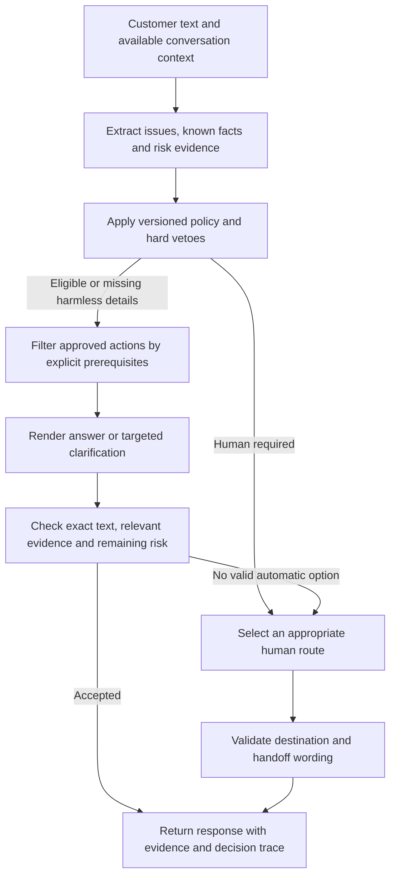

# Cadence: a plan for useful automation with reliable escalation

**Analysis date:** 18 September 2026  
**Scope:** analysis and proposed implementation; no agent, policy, benchmark, or deployment changes made.  
**Starting point:** released reference agent plus the completed Quality and Balanced experiments.  
**Evidence:** the same 80 messages, 240 predictions and 240 blinded Astra reply ratings from `results/balanced_confirmation/`, joined to their frozen routing labels. These latest labels and ratings are AI-authored; Arnav's earlier verification applies to the earlier study.

## 1. Recommendation

Build one new experimental candidate around **independent risk assessment, executable answer prerequisites, and precise clarification**. Keep the three existing systems as comparators. Broaden verified knowledge only after those foundations work, then use controlled experiments to choose the simplest successful configuration.

The aim is the highest **policy-compliant useful automatic coverage** within explicit risk, latency and cost limits. A good system should answer an eligible question, ask a genuinely necessary question, or make an appropriate handoff. Some requests require account access or human judgment, so automatically solving every possible case is neither feasible nor the correct objective.

The current evidence supports a specific hypothesis: retain Balanced's useful public guidance, recover the comparators' better clarifications, and prevent an available answer from erasing a risk signal. It does not establish that combining the agents will automatically deliver those gains.

## 2. What the detailed comparison reveals

### Fair comparison on the same 80 messages

There are 38 required escalations and 42 messages eligible for automatic handling under the frozen policy.

| Measure | Reference | Quality | Balanced |
|---|---:|---:|---:|
| Automatic replies | 28 | 7 | 30 |
| Raw automatic coverage | 35.00% | 8.75% | 37.50% |
| Useful automatic replies, published definition | 6 | 6 | 13 |
| **Useful automatic replies that also obey gold routing** | **6** | **6** | **11** |
| **Policy-compliant useful coverage, denominator 80** | **7.50%** | **7.50%** | **13.75%** |
| Policy-compliant useful resolution-style replies | 0 | 1 | 9 |
| Policy-compliant useful clarifications | 6 | 5 | 2 |
| Missed escalations | 4 | 0 | 4 |
| Unnecessary escalations | 18 | 35 | 16 |
| Automatic replies flagged by the existing acceptance rule | 15 | 0 | 4 |
| Intent accuracy | 78.75% | 77.50% | 81.25% |
| Intent macro F1 | 0.7511 | 0.7154 | 0.7624 |
| Successful-invocation p95 | 4.064 s | 4.533 s | 3.855 s |
| Total recorded input/output tokens | 205,542 | 199,047 | 386,582 |

The published usefulness definition assesses the reply, while routing safety is checked by a separate acceptance gate. Balanced's 13 includes `b4_052` and `b4_072`, which require escalation under the frozen policy. The new intersection metric excludes them. The archived 13/80 remains correct under its original definition and must not be overwritten.

The existing flag gate counts any explicit review flag **or** content safety below 4/5. All four Balanced flagged automatic replies concern the wrong issue; this is distinct from its four routing misses. The two sets overlap in `b4_027`. A 5/5 content-safety score does not establish that automation was appropriate.

### Complementary strengths are measurable

Across the three systems' existing automatic outputs, **17/80 messages have at least one policy-compliant useful reply**. Balanced covers 11 of them. The six additional cases are:

| Case | Better behavior already present elsewhere | What Balanced loses |
|---|---|---|
| `b4_014` | Ask specifically about incorrect artist attribution | Frames the question as finding music |
| `b4_021` | Ask for device details before advising on playlist search | Sends a feature-proposal link |
| `b4_023` | Clarify the playback obstruction within feature feedback | Addresses only the feedback |
| `b4_047` | Ask what is difficult about collaborative playlists | Escalates on intent confidence |
| `b4_066` | Ask device/version for offline stuttering | Treats diagnostic uncertainty as ambiguity |
| `b4_074` | Ask device/version for an availability error | Repeats the already supplied artist question |

**17/80 is a hindsight selection ceiling over these stored automatic outputs**, using labels and reviews unavailable at runtime. It is not a working ensemble result, not a target guaranteed on new cases, and not the maximum a redesigned agent could ever achieve.

### The causes are more specific than “too cautious” or “too risky”

1. **Quality lacks suitable actions and exits too early.** Of its 35 unnecessary escalations, 27 are recorded as account lookup and only two as low confidence. Its public catalog contains five clarification cards and two playback procedures. Lowering the confidence threshold alone will not recover most coverage.
2. **Balanced lets answer availability influence risk interpretation.** In `b4_027`, its stored audit rationale dismisses directed abuse because self-service guidance is available. In `b4_072`, the catalog answer distracts from an explicit discrimination allegation.
3. **Answer applicability is prose, not an enforced contract.** Library filters are applied to offline downloads; personal playlist creation becomes feature feedback; supplied artists are requested again. Both selection and review use the same model, so a second opinion is not independent evidence of correctness.
4. **A narrow response inventory shapes the answer.** Twelve of Balanced's 30 automatic replies use the same Ideas-board card; eight use the catalog card. Twelve automatic replies are classified as handoffs, and one as social acknowledgment. Automatic response count substantially overstates useful resolution-style help.
5. **Some policy boundaries are inconsistent.** Social closure and public display-name help have candidate actions permitting automation but frozen labels requiring escalation. These deserve a prospective policy decision, not retrospective removal of failures.
6. **Escalation wording can itself be wrong.** `b4_053` routes a student-bundle reconnection problem to SheerID verification. Early handoffs bypass the second-call audit.
7. **High intent confidence is not a risk estimate.** All four Balanced routing misses have confidence at least 0.95. Conversely, a low-confidence distinction between playback and offline issues can still permit a useful diagnostic question.
8. **Retrieval quality is not yet measured in this study.** Its 1,455-row retrieval-review worksheet has no completed review judgments. Additional retrieval sophistication should follow diagnosis, not precede it.

## 3. First fix the objective and the policy contract

### Primary outcome

Define a new, versioned metric:

`policy-compliant useful coverage = count(auto AND gold permits auto AND exact reply passes the usefulness rubric) / all evaluated messages`

Keep resolution-style answers and necessary clarifications separate. Neither is an observed support-ticket closure. Report useful handoffs and social acknowledgments separately; do not increase resolution coverage by renaming them.

Use constraints before optimization: mandatory-risk errors and unsupported actions are unacceptable tradeoffs for small coverage gains. Within admissible configurations, compare useful coverage, unnecessary handoffs, latency and cost. Publish the nondominated options when one is safer but another is cheaper or more helpful.

### Prospective policy version

Write a short decision table before coding or collecting new confirmation labels:

| Situation | Proposed behavior to freeze for the next experiment |
|---|---|
| Actual billing dispute, unauthorized account access, legal/safety allegation | Human route; useful acknowledgment or limited public context may accompany it |
| Account recovery or individual eligibility decision | Human route; no invented account lookup or approval |
| General public how-to mentioning an account | Public guidance if current sources authorize it and no intervention is requested |
| Public display-name question | Distinguish visible-name guidance from identity verification, login changes and account recovery |
| Directed abuse, explicit churn, repeated unsuccessful support contact | Apply a documented escalation boundary independently of available answers |
| Ordinary criticism, “again” referring to product changes, incidental profanity | Do not infer repeated contact or severe risk without supporting evidence |
| Recognizable technical issue with missing device/error information | Necessary clarification if material risk is absent |
| Screenshot-only or unintelligible request | Human route under the existing scope; do not pretend to have inspected media |
| Pure gratitude or resolved social closure | Allow a bounded acknowledgment under the new policy; count separately from support resolution |
| Unsupported request or language | Honest scoped fallback; never fabricate ability or interpretation |

These are proposed boundaries for a new policy, not corrections to the frozen gold. Have the project owner validate the decision table and independently annotate its examples. Score every arm against the **same** new policy labels; retain a separate compatibility report under the old policy. Run historical comparators with their own archived code/configuration, never silently replacing their policies. Add a separately named policy-only Balanced control in development to distinguish gains from policy changes from gains in request understanding or answer selection.

### Temporal contract

The messages are historical, but candidate guidance is current. Freeze evaluation as “present-day assistance for a historical customer utterance,” with an explicit source as-of date. A 2017 request for a feature does not establish that the feature remains unavailable today. Historical conversations ground brand tone, issue patterns and diagnostic approaches; current official sources authorize current procedures and policies.

If historical simulation is later wanted, make it a separate track with historical sources. Do not mix both targets in one score.

## 4. Recommended architecture

### A. Interpret the request before presenting possible answers

One structured model call extracts primary and secondary issues, requested outcome, feature, device, plan, affected scope, exact error, named entities and steps already tried. Each value includes a supporting text span; unknown stays unknown.

Risk extraction covers money movement, security, legal/safety, actual account intervention, directed abuse and churn. It sees the customer's message and policy, not a list of attractive answers. Use explicit true/false/unknown values where ambiguity matters. Validate that quoted spans exist; this checks trace integrity, not the semantic truth of the model's interpretation.

Combine this with deterministic rules. Improve known morphology gaps such as “discriminating,” but also test quotation, negation, slang, target and tense. Hard risk findings cannot be downgraded by a later answer selector. Unresolved material risk requires a human; uncertainty about an intent name alone need not do so.

### B. Turn response cards into executable capabilities

Each card declares: supported issue/outcome, required known facts, forbidden conditions, already-tried exclusions, required source claims, response kind and allowed safe slot substitutions.

Examples:

- `library_filters` requires missing saved-library content; excludes lost offline downloads.
- `ask_artist` requires a genuinely missing relevant artist identity.
- `student_verification_handoff` requires verification failure; bundle reconnection alone is insufficient.
- `feature_idea` requires a real change request and cannot replace diagnosis of a playback blocker.
- A plan-specific procedure requires the relevant plan to be known; otherwise ask about it.

A deterministic validator checks every primary and fallback card. A model choosing a card does not satisfy missing prerequisites. Preserve constrained facts and URLs; use safe phrase variants to acknowledge the actual issue without enabling arbitrary procedural generation.

### C. Prefer precise clarification over premature handoff

Ask only missing information that could change the next action. Do not repeat an artist, device or error already supplied. Distinguish unknown diagnosis from unintelligible input. For mixed feedback and malfunction, address the actionable malfunction first.

Start within the existing single-message contract. If conversation state is later added, store known facts, prior questions and attempted steps; prevent clarification loops and test the entire follow-up conversation separately. Do not claim single-turn question quality proves eventual resolution.

### D. Validate every final response, including handoffs

The second model call, where needed, selects among a small set of already eligible, exactly rendered alternatives using only their relevant sources and diagnostic history. Return a separate exact-text verdict for every alternative eligible for later re-selection. If only one alternative was assessed, the only fallback is a previously validated handoff. The check may veto an answer, but cannot clear a locked mandatory-risk decision. This is an internal check; its correctness must be evaluated by separate reviewers.

Use the same deterministic applicability checks for handoffs. A rejected answer may trigger one deterministic re-selection from already assessed alternatives. Avoid unbounded retries or hidden extra model calls. If no useful supported option remains, give the correct scoped handoff.

Record distinct blocking reasons: account access, material risk, missing source, unmet prerequisite, model failure, deadline, or no useful supported answer. Do not call every limitation `needs_account_lookup`.

Validate the exact final 280-character output after formatting. Required conditions, warnings and links must survive shortening. No new wording should appear after its review without being checked again.

### E. Version the knowledge rather than expanding hard-coded strings

Each current claim needs an official URL, dated source snapshot/excerpt and content hash, applicable plan/device/region, reviewer, last verification and recheck/expiry rule. Separate current sources, historical conversations and local response policy in the evidence schema.

Refresh sources offline. Expired or missing authority cannot authorize a current procedure; use a supported question or honest fallback. Attaching a modern URL to a historical reply is not proof that the old procedure remains valid.

Historical retrieval remains part of the assignment: measure whether examples support brand tone or the diagnostic next step. Compare a compact relevant history selection against the existing six-hit context. If no relevant history is found, expose that fact; do not invent grounding. Treat a no-history arm as an ablation rather than silently discarding the assignment's historical-grounding requirement.

### F. Spend computation where it can change the answer

Start with a maximum of two planned model calls: request/risk extraction, then exact-response selection/review. Obvious handoffs may need only the first call plus validated rendering. Count retries separately and cap total attempts/deadline.

Do not send all 25 cards and every source to both stages. Filter locally, then send the few valid alternatives and supporting claims. Compare compact versus full evidence before adopting the optimization. A stronger model or third repair call is a later ablation only if it resolves a measured remaining weakness sufficiently to justify cost.

## 5. Coverage plan for every current intent

These slice counts describe this sample, not class-level performance estimates. Some classes contain only one message.

| Intent | Cases / auto-eligible | Balanced policy-compliant useful | Main implementation opportunity |
|---|---:|---:|---|
| Account hacked/security | 3 / 0 | 0 | Reliable human route, no credential requests or account-action promises |
| Billing/charges | 7 / 0 | 0 | Distinguish actual money issues from public offer information; retain mandatory-risk routing |
| Content/availability | 10 / 9 | 6 | Distinguish unavailable catalog, visible-but-unplayable tracks and service-country availability |
| Download/offline | 4 / 3 | 1 | Separate downloaded copies, saved music, local files and offline stuttering |
| Feature/feedback | 12 / 12 | 0 | Check current capability; distinguish feedback, existing-feature help and a secondary malfunction |
| Login/account access | 6 / 0 | 0 | Preserve recovery/security escalation; prospectively define public profile how-to separately |
| Metadata/artist | 1 / 1 | 0 | Ask for incorrect attribution and relevant release links; verify the appropriate specialist route |
| Non-English | 1 / 0 | 0 | Explicit unsupported-language behavior; multilingual automation is a separately tested expansion |
| Other | 16 / 0 | 0 | Split closure, missing context, complaints and out-of-scope messages in policy/action handling |
| Playback/app | 10 / 9 | 4 | Slot-aware troubleshooting; no inferred device, unverified outage or repeated procedure |
| Playlist/library | 3 / 3 | 0 | Distinguish collaboration, creation, search, saved-library state and recommendations |
| Subscription/plan | 7 / 5 | 0 | Public terms versus individual eligibility, verification, bundle connection and expired promotions |

Do not optimize only the largest classes. Add a separate boundary suite for secondary risks, mixed issues, quoted abuse, negation, repeated contact, unavailable media, stale evidence, absent knowledge and model/HTTP failures. Include a small out-of-distribution suite for unsupported brands and languages, with correct fallback as the success criterion.

## 6. Implementation sequence and concrete deliverables

### P0 — Preserve reproducibility before changing shared configuration

**Why first:** the existing experiment snapshots `.py` files, but the reproducer resolves frozen non-Python configuration against the mutable repository root. Editing shared policy files can therefore break historical verification.

**Work:** archive exact old config, labels, rubrics and relevant knowledge bytes against their existing hashes; add a backward-compatible verified archive resolver. Do not regenerate predictions or rewrite old hashes. For future runs, freeze the entire execution dependency set, including actual rubric text, knowledge snapshots, model settings and policy version. Add append-only migration records when needed.

**Targets:** `scripts/23_balanced_experiment.py`, `analysis_tools/reproduce_balanced.py`, `src/cadence/eval/provenance.py`, related experiment scripts and tests.

**Acceptance:** all existing reported results still reproduce after a new policy is introduced; mismatched snapshot bytes fail verification; actual rubric text and current-source evidence are bound to new runs.

### P0 — Freeze policy, rubric and metrics for the next candidate

**Work:** create the decision table above; define present-day evaluation; add policy-compliant usefulness without removing legacy metrics; separate routing errors, unsupported actions, sensitive-data requests and wrong-issue replies. Distinguish capability absence from account-access need.

**Targets:** versioned policy config, `docs/TAXONOMY.md`, `CONTRACT.md`, `scripts/18_review_coverage.py`, `src/cadence/eval/review.py`, `analysis_tools/reproduce_balanced.py` or a new versioned reproducer.

**Acceptance:** each metric has an explicit numerator/denominator; old and new policy scores are clearly separated; the policy has contrastive examples independently reviewed before candidate inference.

### P1 — Independent request/risk extraction and immutable risk veto

**Work:** add `src/cadence/agent/request_frame.py` and `policy_v2.py`; extend trace metadata additively. Fix rule omissions with contrastive tests, not exact-ID exceptions. Leave existing agent behavior frozen.

**Acceptance:** a maliciously or mistakenly permissive planner/auditor cannot release a case with an established mandatory risk; quotations, negations and benign near-matches do not mechanically become risk findings. Primary and secondary issues both participate.

### P1 — Typed action registry and precise fallback

**Work:** add `src/cadence/agent/actions.py` and a versioned support-action registry. Implement prerequisites, limited safe rendering, known-fact exclusion and handoff validation. Build a new candidate using the existing response API.

**Acceptance:** general tests cover all seven distinct cases in Balanced's routing-miss/flag union, plus `b4_053`, `b4_059`, `b4_066` and the six complementary wins. Include unseen paraphrases and contrastive examples. Passing mocked model outputs alone is insufficient; run real development inference too.

### P1 — Knowledge coverage for the highest-value gaps

**Work:** source-backed cards for playlist and device behavior, downloads versus library, current feature availability, artist attribution, public country availability and student-bundle versus verification guidance. Verify relevant official sources during implementation; do not assume today's product facts from this plan.

**Targets:** proposed `src/cadence/knowledge/`, `config/knowledge/`, approved action registry; current constants in `agent/quality.py` and `agent/balanced.py` remain archived comparator behavior.

**Acceptance:** every new procedure has applicable source claims; missing/expired/wrong-platform sources block release. More cards must improve matched development cases without reducing risk protection.

### P2 — Measure and improve retrieval only where needed

**Work:** independently assess a fixed development subset for issue relevance, useful diagnostic pattern, support for proposed action and current authority. Compare BM25 with a request-frame query and simple issue/slot reranking. Inspect first-reply versus later-resolution extraction on multi-turn threads.

**Targets:** `src/cadence/retrieval/index.py`, evidence construction in `agent/pipeline.py`, review tooling.

**Acceptance:** measurable retrieval improvement translates into better final replies; holdout component/near-duplicate exclusions remain intact. Embeddings or a cross-encoder are optional later experiments, not prerequisites.

### P2 — Cost, failure handling and calibration

**Work:** compact evidence, bounded attempts, source outages and timeout behavior; separate intent confidence from release eligibility. Calibrate action/release thresholds using a distinct calibration set, without tuning on confirmation results.

**Acceptance:** all failures count in end-to-end reporting; the candidate does not acquire better latency by excluding failed requests. Safety cannot be bypassed to meet the deadline. Return a validated fallback.

### P3 — Confirm once, review, then release if qualified

**Work:** execute the preregistered matched comparison, independently review results, validate code/evidence/UI/PDF, and regenerate publication artifacts from the accepted result. Bind the actual deployed agent/config/model to the release record. If gates fail, preserve the failed candidate and keep deployment decisions explicit.

**Acceptance:** clean reproduction, appropriate tests, independent review, consistent public metrics/provenance and exact deployment revision; submission form remains outside this work.

## 7. Experiments that identify what actually works

Run development experiments sequentially. Keep model/version/settings constant initially. Use the new frozen policy consistently for E1 onward; include the separately named policy-only control so behavior gains are not confused with a changed routing target. Original comparator code/configuration stays archived.

| Experiment | Change | Question answered |
|---|---|---|
| E0 | Frozen comparators | Establish matched baseline behavior |
| E1 | Independent risk extraction only | Does separating risk reduce missed escalations without broad over-escalation? |
| E2 | Typed action prerequisites only | Does executable applicability remove wrong-issue/repeated-question errors? |
| E3 | E1 + E2 + precise clarification/handoffs | Can the combined approach recover useful clarifications safely? |
| E4 | E3 + verified knowledge expansion | Do new sources improve genuine answer coverage? |
| E5 | Compact relevant evidence versus full evidence | Can token cost fall without losing quality or safety? |
| E6, conditional | Alternative model or bounded repair; optional retrieval upgrade | Does additional complexity address the remaining measured defect? |

Use blinded exact-reply review on changed outputs, retaining content hashes. Reuse identical recorded outputs only for development quality comparisons; do not count replay time as fresh latency. Select one candidate and its thresholds before the next confirmation. If a change does not improve an admissible tradeoff, remove it.

### Data partitions

- **Development/regression:** all already inspected examples, including this 80-case study. Their historical confirmation results remain valid for the old candidate; they are not unseen evidence for the next one.
- **Calibration:** initially 100 disjoint real messages for threshold and model selection. Treat this as a pilot; use coarse action families and disclose sparse risk slices. Expand before freezing if it cannot support the intended decision.
- **Representative confirmation:** 200 disjoint real customer messages under a declared sampling distribution, excluding inspected conversation components and near-duplicates. Include messages without brand replies only if they are actually present in the loaded corpus; otherwise document and test that domain separately.
- **Boundary/challenge suite:** initially 80 independently prepared cases covering risk morphology, mixed intents, missing/known context and operational failure. Separate genuine held-out cases from synthetic contrastive tests. Do not blend an oversampled challenge score into prevalence-weighted coverage.

Freeze sampling, model, policy, source snapshots, rubric, seeds, thresholds, resource limits and comparison plan. Have the named human reviewer label **all 200 representative confirmation messages before any candidate/comparator inference on them**, using customer text and policy without seeing system outputs. For independent hand-labeling, also hide AI labels until the human's initial labels are submitted; preserve both initial labels and subsequent adjudication. If AI labels are instead visible during verification, explicitly describe that as AI-assisted human verification, not independent annotation. Apply human policy review to the boundary suite before its scored inference as well. Review records bind these exact artifacts and do not automatically extend to future outputs.

Run the new candidate and all three comparators on the same final 200 messages: **800 predictions**, plus explicitly budgeted challenge runs. With current stage limits this is at most approximately 1,600 planned generation-stage model calls for the representative comparison before retries, assuming Quality uses up to three and the new candidate up to two. Reviewer calls and calibration/development runs are additional. Compute the actual budget from the frozen configuration before execution.

### Independent review and judge calibration

Review all final predictions with a blinded AI rubric, then obtain a prespecified independent human subset: for example 50–60 matched messages across four systems, yielding 200–240 reply ratings. Hide model identity and prior judge scores for this new independent study. Human-verified AI scores remain a separate valid provenance category.

Measure judge agreement on exact reply scores/verdicts with matched identities and per-message uncertainty. Report agreement per dimension and disagreement examples; two presentation orders do not create two independent human ratings. Review routing labels as well as replies. Rare-risk labels and disagreements require adjudication without silently replacing the original record.

If numerical thresholds or the rubric change during calibration, freeze the final version before confirmation. A runtime audit, a blinded AI reviewer and a human reviewer have different roles; do not treat any as interchangeable.

## 8. Acceptance criteria

These are proposed **future** criteria. Existing failed gates remain unchanged. Freeze final numeric choices before new confirmation; do not choose them after seeing results.

### Hard correctness requirements

1. All declared mandatory-risk regression and challenge cases must retain the required route; no bypass through fallback, secondary intent, timeout or formatter.
2. No invented account/staff action, sensitive-data request, or unverified procedure may be released automatically in the reviewed confirmation/challenge sets.
3. Every chosen action and handoff must satisfy its executable prerequisites; no repeated known-fact question in the targeted tests.
4. Exact new routing labels and reply reviews receive the planned human review, with accurate provenance and hashes.
5. Frozen historical reproduction, public API compatibility and source/model/config identity pass independent acceptance.

### Statistical and practical requirements

| Dimension | Proposed decision rule |
|---|---|
| Mandatory escalation safety | Zero observed missed mandatory escalations on confirmation across every mandatory risk family under the frozen policy, and zero required-route failures on the challenge suite; total misses must therefore also be no higher than Quality's on the same cases. Report exact one-sided bounds and risk-family denominators |
| Policy-compliant useful coverage | Positive paired improvement over Balanced on representative confirmation; a 95% interval excluding zero supports a superiority claim; otherwise report inconclusive evidence |
| Useful response mix | Report resolution-style answers and necessary clarifications independently; no apparent gain caused only by repeated questioning or reclassified handoffs |
| Wrong-issue automation | Zero observed wrong-issue automatic replies under the frozen rubric, including nonsevere mismatches; report severity slices separately from risk-routing failures |
| Intent performance | Preserve overall and per-class reporting; preregister a practical non-inferiority margin rather than choosing one after seeing the scores |
| Latency | Retain 7.5-second p95 as the initial ceiling, with fresh observations; additionally report end-to-end completion/failure/timeout rates and retry-inclusive latency |
| Cost | Initial design target: at most 1.25× reference tokens/message, versus Balanced's observed 1.88×; report realized monetary cost only if provider usage/billing data support it |
| Useful work per cost | Report tokens per policy-compliant useful reply alongside tokens/request; neither alone measures business value |

The 1.25× cost target is an engineering proposal, not a measured guarantee. If a more expensive configuration offers materially safer/better behavior, present the explicit tradeoff rather than claiming a universal winner. The final acceptance contract must distinguish required limits from optimization goals before the run. Freeze the error-severity rubric before inference; do not downgrade a failure's severity after seeing which system produced it.

### Why zero observed misses is not proof of general safety

Quality's zero misses among 38 required-escalation messages has a **7.58% one-sided 95% upper bound** on the miss rate under an independent, representative binomial model (the exact bound, numerically rounded). Zero unsafe outcomes among only seven automatic replies would still permit a **34.82%** upper bound for that separate conditional rate.

For zero errors, the exact one-sided upper bound is `1 - 0.05^(1/n)`. It takes at least 59 relevant zero-error examples to get below 5%, 149 below 2%, and 299 below 1%. “Relevant” means the correct denominator: required-escalation cases for miss rate, automatic replies for conditional automatic-error rate. Risk-enriched challenges cannot establish population-weighted coverage, and these assumptions do not cover distribution drift or annotation mistakes.

Choose sample size from the desired claim, not a convenient total. A 200-message confirmation may still be inconclusive. Any extension must be preregistered or treated as a new study with fixed code, not repeated testing until a result passes.

The risk-versus-coverage framing follows selective-classification research; that work supports the evaluation concept, not a statistical guarantee for this LLM system. See [Geifman and El-Yaniv, NeurIPS 2017](https://papers.neurips.cc/paper_files/paper/2017/hash/4a8423d5e91fda00bb7e46540e2b0cf1-Abstract.html). Exact binomial interval methodology is described in [NIST's documentation](https://itl.nist.gov/div898/handbook/prc/section2/prc241.htm).

## 9. Review and release checklist

For each work package, require a concrete acceptance pass:

- **Code:** focused unit/contract tests for the changed behavior, then the required full suite and UI checks when integration changes.
- **Behavior:** real development inference; inspect failures by risk and action family, not just aggregate F1.
- **Evidence:** source snapshots, correct exclusions, exact output/rating hashes, immutable prior results and honest human/AI attribution.
- **Statistics:** correct denominators, matched examples, clustered uncertainty for repeated ratings and declared selection rules.
- **Product:** automatic answer, clarification and human route remain legible; no claim of executed actions without integrations.
- **Publication:** README, six-page report, site charts and deployed version identify the same chosen system and distinguish historical results from new evidence.

Do not promote merely because a candidate beats the current reference. The reference itself has measured routing and reply weaknesses. The release decision must satisfy the new capability/risk contract and clearly distinguish a hosted evaluation demo from unattended customer-service deployment.

## 10. Suggested execution schedule and stop conditions

Estimate: **7–10 focused engineering days plus human-review time**, subject to API limits and sample sufficiency. This is a planning estimate, not a commitment.

1. Days 1–2: archive compatibility, policy/rubric decisions, new metrics and review packet.
2. Days 2–4: request frame, risk veto, typed actions, handoff and clarification tests.
3. Days 4–5: verified knowledge expansion and compact evidence.
4. Days 5–6: controlled development ablations, calibration and independent code review.
5. Days 7–10: frozen confirmation, human review, uncertainty analysis and publication if qualified.

Stop adding features when the chosen candidate meets the declared gates and more complexity has no measured value. Stop promoting when evidence is inconclusive or a required gate fails. Preserve the result, identify the next falsifiable hypothesis, and use genuinely new confirmation evidence for a materially changed candidate.

The most valuable first implementation is **P0 reproducibility/policy/metrics, followed by P1 risk extraction and executable action applicability**. Fine-tuning, a vector database, external account integrations and a multi-agent runtime are not prerequisites supported by the current failure evidence.

## Appendix: analysis artifacts and audit targets

- `output/analysis/cadence-plan-audit.py`: standard-library reproduction of the joined diagnostic counts; no API calls.
- `output/analysis/cadence-plan-evidence.json`: derived metrics, case IDs, intent slices and SHA-256 hashes of the input file bytes.
- `results/balanced_confirmation/summary.json`, `ACCEPTANCE.json`, predictions and exact reply reviews: measured starting evidence.
- `data/balanced_confirmation/labels.jsonl`, `LABEL_REVIEW.json`: routing gold and its provenance.
- `scripts/18_review_coverage.py:15`: legacy usefulness definition.
- `analysis_tools/reproduce_balanced.py:94`: acceptance computation; `:144`: frozen-input resolution.
- `src/cadence/agent/balanced.py:81`: joint plan schema; `:127`: planning; `:159`: early handoff; `:175`: exact-response audit.
- `src/cadence/agent/quality.py:43`: limited approved-action schema.
- `src/cadence/agent/pipeline.py:213`: routing precedence; `:277`: final integrity checks.
- `config/escalation.yaml:49`: legal/safety rules; `:80`: repeated-contact soft signal.

No fresh model experiment was run for this plan. Quantitative improvements proposed above remain hypotheses until implementation and independent confirmation.
