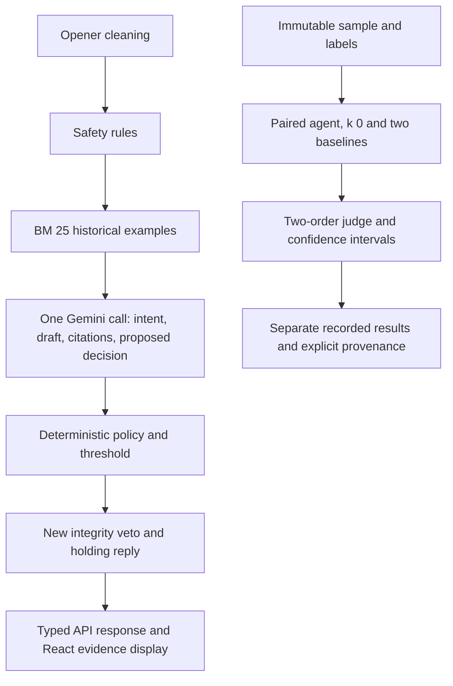

# Cadence: independent engineering audit and implementation record

Audit baseline: `7ed653e2827a2a99d42885d9a974c74988f42974`. Work branch: `codex/submission-evidence-and-safety`. Complete frozen benchmark revision: `b8317d6d91813d4d6d83336fb3eb05a1d032d52b`; earlier aborted revision `c774b96` is preserved separately. Inspected 15–16 September 2026. The supplied external AI audit was treated as hypotheses, not evidence. Remote inspection found only `main` and no PRs at audit time.

## Executive verdict

**A strong, inspectable prototype; the original proof was overstated.** The data pipeline, lexical retrieval, structured generation, policy layer and UI are real. Original headline metrics reproduce from saved predictions. They do not establish human agreement or production safety. A separate completed 200-message benchmark now establishes the frozen revised code’s measured behavior: .789 macro-F1, .938 recall, 35% automatic decisions, and five missed escalations. Subsequent guard repairs have explicitly retrospective verification. The historical test set was repeatedly used to guide fixes; zero-shot changed more than retrieval; the claimed dev recall constraint was missed; and evidence membership was mistaken for grounding.

The practical submission improvement is to repair these claims, isolate immutable evidence, strengthen release checks, and run paired experiments on a fresh explicitly AI-reviewed sample. The author requested no human review. Accordingly, all 200 new messages have AI labels and individual rationales; **the assignment's human-labeling and judge–human agreement requirements remain unmet**. Neither AI–AI agreement nor order consistency substitutes for that evidence.

Preserve: the compact Python pipeline, BM25, small corpus, typed responses, deterministic policy precedence, two inexpensive model roles, visible retrieved evidence, and offline reproducibility. Do not add a vector database, autonomous account tools, fine-tuning, multi-agent orchestration, a distributed queue or a large risk model for this take-home.

## Evidence scope and assumptions

- Goal: maximize useful, correctly grounded auto-handling, conditional on escalation safety. An intent score alone is insufficient.
- Dataset support labels describe what can be answered publicly from the opener, not whether the eventual historical agent asked for a DM. Historical brand behavior is evidence, not infallible ground truth.
- Public Twitter text is historical, cleaned and still potentially personal. Free-tier calls were requested by the author. Billing tier and key-to-project mapping cannot be verified from the keys.
- The benchmark reviewer is Codex, which also implemented changes. It saw the taxonomy/policy, but labelled the fresh messages before seeing their predictions. This reduces prediction anchoring, not shared-model or developer bias.
- The deployed commit is unknown. Read-only health/HTML probes establish availability and metadata only. No production handler call or redeployment was performed.
- File references below are repository-relative, one-based anchors at the frozen execution revision unless explicitly marked later. Historical claims refer to the baseline commit.

## End-to-end trace

| Stage | Implemented behavior / evidence | Important boundary |
|---|---|---|
| Preparation | `src/cadence/data/clean.py: 103`, `data/threads.py: 84`; committed cleaned corpus and stats | Mention/URL cleaning does not guarantee removal of every personal identifier; threads can omit private DM outcomes |
| Retrieval | `retrieval/index.py: 197`, `: 289`; BM25, k=6, usefulness multipliers, near-duplicate checks | Lexical overlap and a useful URL are not relevance labels or proof the resolution applies |
| Generation | `agent/pipeline.py: 253`, `agent/prompts.py`; one structured call after retrieval | Retrieved examples can still anchor classification; prompt delimiters are defense in depth |
| Escalation | `agent/pipeline.py: 211`, `: 275`; rules, primary/secondary intent defaults, 0.9 confidence guard, integrity veto | Confidence is not calibrated escalation risk. Escalation can be correct while the draft is poor |
| Evaluation | `eval/paired.py: 12`, `eval/blind_judge.py: 17`, `scripts/12_run_holdout.py: 28` | Paired samples and two presentation orders; same-family judge and no human ratings |
| API | `api/index.py: 134`, `src/cadence/api/core.py: 16` | Per-process slots/deadlines, authenticated admin; no distributed abuse control |
| UI | `ui/src/` types and decision display; historical dashboard artifacts | The public deployed site predates this branch. Historical charts must remain labelled historical |

### Existing architecture → revised take-home architecture

A possible later architecture is rule-based short-circuit → independent risk/intent decision → selective retrieval → draft → integrity veto. This is an **experiment**, not the proven optimum. It introduces another model call on eligible messages, a router error mode and more latency. Keep the current one-call path until paired measurements show better safe coverage or clearly lower cost.

## Existing vs planned vs recommended

Benefits below are hypotheses unless linked to measured results. Effort is approximate engineering time, not a delivery guarantee.

| Current evidence | Existing plan | Recommended change / status | Rationale | Expected benefit | Effort / cost / risk | Validation / acceptance | Priority |
|---|---|---|---|---|---|---|---|
| Historical AI test reused across three runs; `REPORT_historical.md` | Tune more rules on known failures | **Done:** separate frozen 200-example AI benchmark, rationales, hashes; no relabeling after prediction | Stops conflating debugging and confirmation | More credible generalization estimate, still AI-biased | 1–2 days; annotation quality remains uncertain | Exact ID/hash checks; publish every system and failed run; no human claim | P0 |
| `metrics.py: 276`; threshold 0.9 dev recall 0.85, not 0.9 | Lower threshold to 0.85 expecting more auto-handles | **Done:** expose fallback selection; retain 0.9 for frozen run. Defer threshold change | Claimed constraint was not met; old test cannot select next policy | Honest operating point | Hours; lower coverage persists | Require recall ≥0.90, bootstrap lower bound ≥0.88 AND no known hard release failures. Frozen numerical gate passed narrowly; hard failure gate failed, and Wilson lower bound .864 warns of sensitivity | P0 |
| Original zero-shot uses different prompt/policy | Treat classification tie as retrieval ablation | **Done:** same prompt/model/policy k6 vs k0, raw and released decisions separated | Citation-required k0 release necessarily escalates; otherwise tautological | Causal evidence about retrieval conditional on this prompt | 100 dev calls; broader holdout budget separate | Paired CI, identical IDs; compare pre-guard drafts for utility | P0 |
| Citation IDs only prove membership; historical missing-link examples g_105/g_137 | Add ~15 canonical links and regexes | **Done before benchmark:** strict URL checks, three verified procedural articles, invalid-citation veto, secondary-risk defaults. **After audit:** completed-action, numeric-limit and private-handoff guards, separately replayed | Smaller verified mapping avoids speculative destinations | Fewer broken/unsupported actionable replies | 1 day; false vetoes reduce coverage; semantic claims remain | Offline hostile URL/commitment tests; no unsafe release fixtures; measure false vetoes | P0 |
| Test exporter overwrote real `results/ui`; Windows reproduce failed | Larger dashboard | **Done:** isolate output paths, hash-checked artifact replay, UTF-8, CI | Evidence must survive its own tests | Reproducible numbers, stable review | Hours; saved predictions remain historical | Tests leave historical files unchanged; reproduce without keys in <15 min | P0 |
| Same-family judge; resource omissions often shipped | More judge calls / new rubric | **Done:** candidate-own evidence, missing-resource penalties, both orders; no human agreement claim | Order and presentation can dominate scores | More diagnostic judge evidence | Two calls per pair; shared biases remain | Publish order disagreement and all ratings; no order cherry-picking | P0 |
| All incoming cases retrieve and generate | Split classify then draft universally | **Defer universal split**; first compare narrow safe preflight/skip-generation paths on dev | Extra calls may erase savings; still need intent output for escalations | Potential cost/latency reduction, unmeasured | 1–2 days + paired calls; router false negatives | Same or better recall bound; no incorrect auto-handles introduced; wall latency and cost measured | P1 |
| BM25 p95<1 ms locally; errors include poor issue match | Hybrid + reranker first | **Done:** useful-link filter, versioned index, eval duplicate exclusion. **Next:** label relevance before hybrid | Retrieval is not the latency bottleneck; quality benefit unknown | Improve evidence utility if lexical misses demonstrated | Relevance review then 1–3 days; model downloads/memory | nDCG@6/usable-resolution@6 and reply delta on fixed pairs; lower CI >0 for selected objective | P1 |
| Five-valued intent confidence, 50 dev | Isotonic risk model on “250 dev” | **Reject that dataset claim.** Compare simple risk features on new dev labels first | Only 50 dev; flexible calibration can overfit | Better risk/coverage curve if enough examples | Additional labels/data, not just compute | Reliability bins with support, Brier score, recall/coverage CI; no fit on holdout | P1 |
| Cold index build, cache copies, unbounded request pressure | Move region or larger instance | **Done:** no copied response cache in deployment, lazy metadata health, two process slots, deadline, sanitized errors, no-store | Avoid startup work and leaking visitor prompts | Better bounded behavior; deployed gain not measured | Hours; per-process limits do not control fleet | API contract/load tests; deployed canary p50/p95 +429/error counts before claiming gain | P0/P1 |
| SHA256 admin hash; public free API budget | Production auth overhaul | **Done:** PBKDF2 option and cookie validation, preserve migration compatibility. **Later:** managed auth/edge budgets | Appropriate reversible patch for demo | More robust auth; brute-force defense incomplete | Hours now; managed auth adds scope |401/403/expiry tests; production requires rate/abuse controls | P1/P2 |
| Historical support data mostly 2017 | Treat retrieved statements as current truth | **Done:** explicit historical status caveat and narrow canonical procedures. **Later:** curated current KB | Cannot infer outages, entitlements or prices from old tweets | Lower policy drift risk | Editorial maintenance + source review | Block current-status/financial promises without verified source; version and expire KB | P1 |

## Alternatives considered

**Retrieval:** BM25 remains the practical baseline: small, fast, auditable and already useful. Hybrid dense retrieval may improve paraphrases but adds model artifacts and startup/memory costs. Reciprocal-rank fusion is simpler than a learned reranker; a cross-encoder adds per-request inference. Test them only after creating relevance labels that distinguish issue match, usable resolution and obsolete advice. BEIR found lexical baselines competitive across heterogeneous tasks, but it does not predict gains here. [BEIR](https://arxiv.org/abs/2104.08663).

**Decision architecture:** one-call generation preserves latency and evidence traceability, but couples intent to retrieved examples. Two-call decide-before-retrieve can decouple intent; it doubles eligible-call count and must still detect a poor final reply. A rules-only early escalation can avoid draft generation on obvious sensitive cases, but still needs classification to satisfy the assignment. A small local classifier is another baseline, not a reason to train on holdout labels. Compare these branches on dev before another locked benchmark.

**Risk:** intent probability, LLM self-reported needs-human confidence and a supervised risk score answer different questions. The target is probability of an unsafe auto-handle after the full pipeline. A simple logistic model with out-of-fold predictions is more defensible than isotonic fitting to five repeated confidence values with 50 dev points, but neither is justified without adequate labels. Until then keep interpretable hard vetoes and report their coverage cost.

**Grounding:** URL allowlisting and citation membership are inexpensive integrity checks. A second verifier model could test entailment, but shares model bias and cost. A curated finite set of approved reply actions has stronger boundaries for production, at the expense of coverage and authoring work. Do not present either untested alternative as optimal.

## Measured runtime, cost and resource evidence

| Measurement | Result | Scope / exclusions |
|---|---|---|
| Historical reproduction | 1,771 verified receipts; 0 model calls; ~1.4 s recalculation | Artifact replay after imports, not pipeline/network latency |
| Revised dev k6,50 live calls | p50 1,437 ms; p95 2,388.85 ms | Local client wall time including client retries/waits; 2 workers; no deployed/browser time |
| Revised dev k0,50 live calls | p50 1,425 ms; p95 2,320.7 ms | Same conditions; no statistically established latency improvement |
| Dev agent tokens | 219,481 input +18,029 output across 100 calls | Successful receipts only; failures can consume unrecorded tokens |
| Index gzip load / rebuild | 0.653 s /0.888 s | Windows 11, Python 3.12.6, one local run |
| Retrieval 250 queries | p50 0.413 ms /p95 0.826 ms | Local warm process; not distributed throughput |
| Process RSS after build/queries | 404,750,336 bytes (~386 MiB) | Whole process, not incremental index allocation |
| Existing deployment health | First observation 7,045 ms; following 7 observations 284–814 ms | Eight read-only requests; first observation is not a proven cold start; no inference measurement |

Raw evidence: `results/audit/offline_measurements.json`, `results/audit/deployment_readonly.json`, the saved dev predictions and call SQLite receipts. Eight health samples cannot establish a reliable production p95. The observed Vercel request IDs included `iad1`; this does not prove that changing region improves user latency. Current limits depend on runtime/plan; consult [Vercel function limitations](https://vercel.com/docs/functions/limitations), not guessed historical limits.

Google's currently published standard rates are $0.30/$2.50 per million input/output tokens for 3.5 Flash-Lite and $0.25/$1.50 for 3.1 Flash-Lite. At those rates the 100 dev agent calls would be about **$0.111**; this is a paid-tier counterfactual, **not a bill**. Actual calls requested the configured free tier; billing is unverified. [Pricing](https://ai.google.dev/gemini-api/docs/pricing).

Key rotation is supported for availability, not entitlement multiplication. Quotas are per project; provider RPD resets at midnight Pacific. The code's persisted UTC counter is a separate conservative local budget and can disagree with the provider day. [Rate limits](https://ai.google.dev/gemini-api/docs/rate-limits). No distributed limiter, sustained throughput experiment, CPU profile, browser interaction distribution, deployment cold-start distribution or monetary invoice was available. One local browser/API success is recorded separately under `results/api_smoke/`: 4,581.5 ms server wall time, 2,542 ms model time. Its retriever includes that message’s own thread, so it is functional verification only.

## Experiment matrix and rollback gates

| Experiment | Fixed factors | Changed factor | Evidence / acceptance |
|---|---|---|---|
| Historical reproduction | Archived predictions, labels, judge receipts | Recalculate metrics only | Exact recorded headline; zero network |
| Dev retrieval ablation |50 dev IDs, model, prompt, threshold, policy |k6 vs k0 | Paired bootstrap 2000; macro-F1 delta−0.0102 CI[−0.1181,0.0825]; no classification win |
| Dev draft-quality ablation |20 dev messages, normalized pre-guard drafts, candidate-own evidence |k6 vs k0, both orders | Mean delta 1.15 CI[0.70,1.625]; order consistency 0.70; exploratory same-family AI result |
| Fresh benchmark |200 labels locked before prediction; 0.9 threshold; all sample threads excluded |agent, same-prompt k0, majority/template, keyword/nearest | Complete: 800 predictions; k6 accuracy delta vs k0 −.03 CI [−.075,.010]. No prompt/threshold tuning |
| Fresh reply comparison |Same 200 inputs and released drafts |agent vs nearest baseline, both orders | Complete: +1.4175/5 CI [1.145,1.6675], order consistency .735; known unsafe replies still score 5/5; no human κ |
| Proposed selective generation |New dev examples and safety constraints |single vs preflight/two-call | Promote only if safe coverage improves with CI and costs/latency meet budget |
| Proposed retrieval comparison |Same candidates, frozen labeled relevance and policy |BM25 vs hybrid vs reranker | Better usable evidence AND reply result; no gain claimed beforehand |

**Rollback/rejection gates:** fail closed on malformed output, unsupported URLs or integrity veto; keep the prior policy if escalation recall target/bound fails; reject an experiment if IDs differ, labels changed or cache provenance cannot be verified; preserve failed runs; never drop errors to improve headline latency. If a new design loses safe coverage without a measurable safety benefit, retain the simpler branch. No production auto-posting is authorized by passing a benchmark.

## Ranked roadmap and file-level work

1. **P0 completed:** `agent/integrity.py`, `pipeline.py`, `prompts.py`, `links.py`, `config/canonical_links.json`; safety checks and scoped canonical links. `eval/paired.py`, `blind_judge.py`, `run_eval.py`; honest paired evidence. `scripts/08_*`–`13_*`, `reproduce_recorded.py`; lock, provenance, review and replay. API input/privacy/retry changes and test-output isolation. Documentation supersedes incorrect human/threshold claims.
2. **P0 acceptance completed:** 800 predictions, 800 judge rows, 800 verified call receipts; offline tests, lint, UI build and artifact replay passed. No prompt, threshold or label changes followed error inspection. General release invariant repairs have a separate 200-case cache-only regression, with no new generalization claim.
3. **P1 next:** `agent/rules.py`/`pipeline.py` selective path experiment; a labeled relevance file and retrieval comparison runner; risk-vs-coverage diagnostics using genuinely new dev data; timeout/minimum-deadline regression tests; inspect generated-current-status claims beyond URL checks. Roll back individual modules through this branch's commits, without rewriting archived labels/results.
4. **P2 production only:** distributed quota/abuse control, managed auth, retention/deletion controls, external observability, current policy KB with owners/expiry, independent quality review and a deployment canary. These are not necessary to demonstrate a sound take-home.

## Primary sources and borrowed methods

Paired resampling follows the principle of preserving paired examples when comparing NLP systems: [Koehn 2004](https://aclanthology.org/W04-3250/). Judge position/verbosity/self-preference biases are documented in [MT-Bench / Chatbot Arena](https://arxiv.org/abs/2306.05685); our own 70% order consistency is the relevant empirical warning here. Canonical articles verified during audit: [reinstall](https://support.spotify.com/us/article/reinstall-spotify/), [offline listening](https://support.spotify.com/us/article/listen-offline/), [password reset](https://support.spotify.com/us/article/reset-password/). Their existence does not establish that any arbitrary retrieved case supports the prescribed action. Unpaid-service data handling: [Gemini terms](https://ai.google.dev/gemini-api/terms).

## Final run and verification status

The first locked run at `c774b96` stopped after 31 messages per system: 124 saved predictions, 69 successful model receipts, no judge phase. A provider HTTP 400 rejected an eight-second remaining deadline. Its exact inputs and partial outputs are retained under `results/holdout/`. Automatic approval review initially blocked resume; the author subsequently explicitly approved the Gemini data transfer. The transport repair reserves a full request window after limiter waiting.

The separate run at `b8317d6` completed **200 messages × four systems, plus both-order judging for all 200 agent/simple pairs**. It has 800 successful receipts, zero cached predictions and zero terminal failures. Three ServerError attempts across two judge requests recovered through bounded retries. Failed-attempt token usage is unavailable. See `results/holdout_final/run_status.json`, `manifest.json`, `summary.json` and raw artifacts.

Measured k6 accuracy .770, macro-F1 .7889, recall 76/81, coverage 70/200; missed-escalation risk 5/70. Raw-model recall was worse with retrieval: paired k6−k0 difference −.1605, CI [−.2456,−.0814]. This challenges moving directly to hybrid retrieval or treating retrieved examples as routing evidence. The judge prefers agent replies by 1.4175/5, CI [1.145,1.6675], but order consistency is only .735. Both h_003’s obsolete limit and h_168’s fictional DM action received 5/5/ship twice. This measured blind spot invalidates using its ship rate as a release gate.

The 400 agent calls used 874,386 input/72,144 output tokens; the 400 judge calls used 396,389/129,779. Published-price counterfactual total is $0.7364, not a bill. Agent successful-prediction latency p50/p95=1,398/2,597.75 ms; k0=1,378.5/2,354 ms. Judge receipt latency p50/p95=3,153/6,717.3 ms. Two-worker agent completion throughput is 1.02 calls/s over the first-to-last receipt interval; excludes startup and is not sustained deployment capacity. Provider model aliases are not pinned internal revisions.

**Post-benchmark hardening:** `src/cadence/agent/integrity.py: 30` and `: 63`, `pipeline.py: 279` block unsupported completed actions, numeric capability limits sourced from history, and private handoffs labelled automatic. `analysis_tools/post_audit_regression.py: 20` replays the same 200 raw responses using a temporary copy of frozen receipts and network-disabled mode. Exactly h_003, h_168 and h_191 change to escalation/holding replies. Two misses remain among 67 auto-handles; recall 79/81. These are post-inspection regression numbers, not fresh performance. Frozen judge scores are not transferred to modified replies. Tests cover generalized examples and allowed public steps; regex coverage remains incomplete.

Final local verification: **283 tests passed**, ruff passed across source/scripts/tests/API/analysis tools, TypeScript and Vite build passed, historical replay verified 1,771 receipts with zero model calls. One upstream SDK Pydantic deprecation warning remains. Local desktop browser checks passed landing/navigation/cache-only error/Clear and one live successful inference, with no console errors or warnings. Mobile flow and revised production deployment remain untested. Machine-readable record: `results/audit/final_verification.json`. Remote CI status is recorded separately when available.

### Rendered UI follow-up

Browser inspection found stale narrative claims still embedded in the landing page and archived caveat JSON. `ui/src/lib/evidenceCaveats.ts` now supplies the current audit interpretation without changing archived scores. Landing and Method explicitly identify AI annotation and test reuse; the live badge respects cache-only mode. Both playgrounds show completed results without replaying model latency as an extra animation delay; no numerical latency gain is claimed. Local cache-miss errors explain the disabled network mode accurately, and README includes `build-index` before local serving. Verification: `results/audit/browser_qa.json`.

### File-level follow-through and remaining gates

`analysis_tools/reproduce_benchmark.py: 27` reports paired-example intervals, null unsafe-auto rate when coverage is zero, and complete-ID checks; `: 65` refuses incomplete/duplicate judge evidence. `tests/test_benchmark_report.py` covers these evidence failure modes. `tests/test_release_actions.py` verifies the new action boundaries. `docs/FAILURE_ANALYSIS_FRESH.md` replaces historical-only failure examples in the submission report. README and UI caveats distinguish frozen inference, historical replay and post-audit regression.

A production candidate still needs a current-policy/action source, fresh quality validation, measured canary latency/errors and abuse budgets. A passing unit suite or retrospective recall increase is not a reason to enable auto-posting. Revert the post-audit guard commit if legitimate coverage loss appears, retaining the frozen artifacts and disabling automatic release for affected cases; never restore known fictional-action replies as a workaround.
