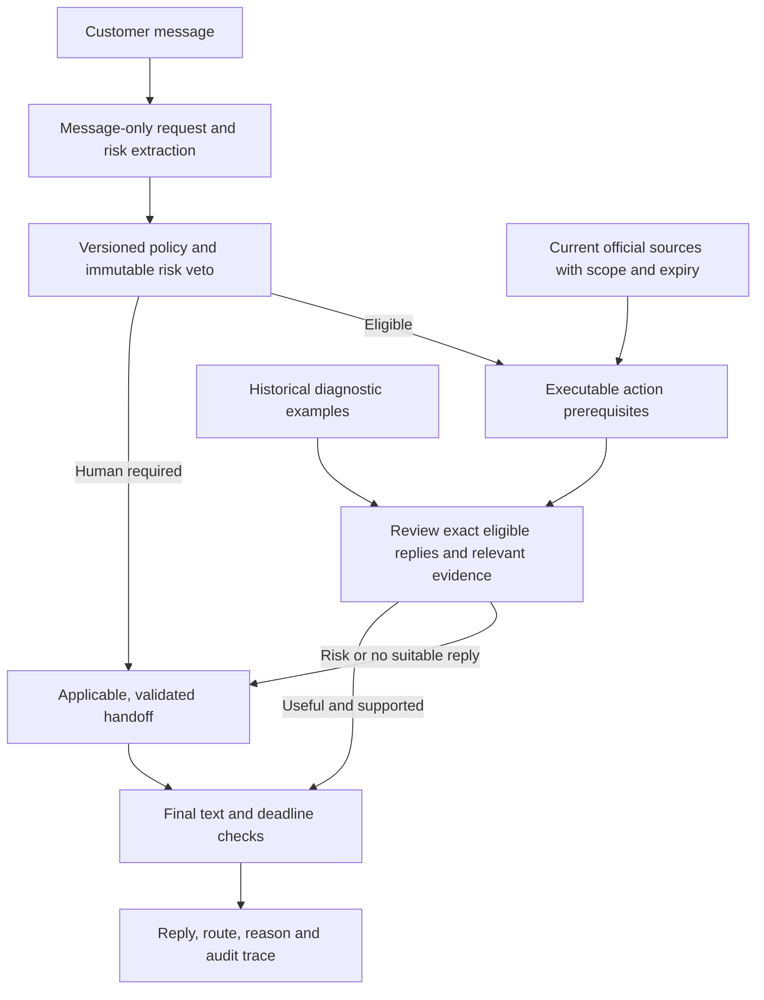

# VerifiedAgent: useful automation with an independent risk decision

**Status:** implemented experimental candidate. The public demo uses the reference `SupportAgent`. New development measurements, new labels and new reply reviews do not inherit Arnav Bule's verification of earlier artifacts.

Read [Verified empirical status](VERIFIED_STATUS.md) for the latest measured results and gaps. This document describes implementation behavior and intended controls; it does not establish their empirical effectiveness. VerifiedAgent and prospective policy v2 are not deployed or promoted, and `SupportAgent` remains the application default.

The completed development v4 and 100-case calibration pilots both missed two required routes and released flagged automatic replies. They predate the latest policy/action-scope patch and explicit knowledge v3. The patch's 18-case selected regression had zero required-route misses and zero flagged automatic replies, but only one useful clarification and seven unnecessary escalations. That result tests specific boundaries; it does not establish restored useful coverage or generalization. Earlier pilots remain unchanged and do not measure the changed implementation.

## What changed

The previous Balanced candidate selected a plausible answer and a routing decision together. Its 80-case study recovered automatic coverage but still missed four mandatory escalations and released four flagged automatic replies. The new architecture separates those decisions.

### Request interpretation

`request_frame.py` extracts the requested outcome, primary and secondary issues, known facts, quoted supporting spans and eight explicit risk states. Answer cards and historical replies are absent from this first prompt. Validation rejects invented quotations and duplicate facts. Brand mentions survive normalization so that removing a handle cannot hide the target of directed abuse.

Policy v2 is prospective and separately documented in [POLICY_V2.md](POLICY_V2.md). Deterministic rules and semantic findings can require escalation. Missing material risk assessments fail closed. A later response review cannot clear that decision. Intent confidence alone does not prohibit an otherwise useful diagnostic question.

### Executable prerequisites and exact replies

`actions.py` checks issue, device, plan, region, known facts, attempted steps and current authority before offering an answer. For example, missing offline downloads do not qualify for a saved-library filter procedure; an artist already supplied is not requested again; Hulu linking does not qualify for a student-eligibility specialist handoff.

Replies are rendered before review. The second call assesses each exact alternative, bound by its text hash. One deterministic fallback selection may choose another individually approved reply. Unreviewed alternatives cannot be released. Handoffs use the same source and applicability checks, including immutable risk flags. Every final reply is checked without truncating away conditions or warnings.

### Current knowledge and historical evidence

The [knowledge registry](../config/knowledge/README.md) contains official article snapshots, precise claims, authority roles, applicability, verification dates and expiry. Missing, expired or mismatched authority cannot authorize a procedure. Current sources support present-day product guidance; 2017 conversations support diagnostic patterns and tone. A modern URL does not validate an old instruction by itself.

The completed pilots froze knowledge v2 with 26 claims and 21 snapshots. The current experimental `VerifiedAgent` explicitly selects the post-pilot [v3 registry](../config/knowledge/v3.json), containing 27 claims backed by those 21 snapshots; the 18-case regression used v3. `KnowledgeStore.load()` without a path retains v2 for compatibility. Versioning preserves the authority actually available to each historical run; a newer registry does not retroactively improve its outputs.

Sources are refreshed and reviewed offline. Request handling does not browse the web. The current corpus contains conversations with brand responses; performance on messages that never received a response is a separate limitation.

### Bounded execution and honest measurements

The candidate plans at most two model calls. A shared deadline and provider-attempt budget cover both stages and retries. Late responses cannot release an automatic reply. Failures produce validated fallback wording and remain failed invocations in evaluation.

Known usage includes unsuccessful provider attempts when metadata is available. Missing or partial usage is marked unknown. Cached work is marked replayed; it cannot support a fresh latency or cost claim. Tokens per request and tokens per policy-compliant useful reply are reported separately.

For saved-summary reproduction, use the [portable verification commands](VERIFIED_STATUS.md#verify-the-saved-evidence), such as `python analysis_tools/verify_portable_summaries.py verified --experiment results/verified_dev_v4`. The wrapper retains original provenance and artifact-hash checks and permits only finite float-to-float summary differences of at most `1e-12` absolute, with no relative tolerance. Counts, types and keys remain exact; source snapshots and saved results are unchanged.

## What remains to be established

Code acceptance establishes tested invariants, not live reply quality or universal safety. The extraction and response-audit models can both be wrong. Short, single-turn clarifications have not been shown to resolve a whole support conversation. No account actions, staff contact, ticket creation, live catalog lookup or real customer resolution is claimed.

The new primary metric is:

`automatic AND gold permits automation AND exact reply passes usefulness review / all messages`

Summaries separate useful resolution-style guidance from necessary clarifications. Social and handoff response kinds remain in the review artifacts and are excluded from primary useful coverage; they have no separate summary quality aggregate. Old scores keep their original definitions and policies. Common-policy rescoring and development ablations separate changed routing targets from changed behavior.

## Evaluation and release

- [Evaluation commands and gates](VERIFIED_EVALUATION.md)
- [Latest empirical status](VERIFIED_STATUS.md)
- [Development ablations and retrieval diagnosis](VERIFIED_ABLATIONS.md)
- [Historical dependency preservation](INPUT_ARCHIVES.md)
- [Accepted implementation plan](../output/analysis/Cadence-Implementation-Plan.md)

The 100-case calibration labels are AI-authored. The new 200-case representative set and 80-case synthetic challenge retain blank human-label packets. The plan requires independently entered human labels for both before scored confirmation/challenge inference. It then requires blinded reply review, the prespecified human reply subset, and matched comparisons with all three historical agents. The preparation tools do not supply human labels or promote a candidate. No submission form is sent by this workflow.
